# LAB 2: ปฏิบัติการ Output Control — DC Load

## การเขียนรายงานส่ง
- Lab 2.1 เปรียบเทียบการต่อไฟตรงกับการขับมอเตอร์ด้วยขาของ MCU - ส่งภาพวงจรและเขียนอธิบายผล
- Lab 2.2 การขับโหลดด้วย Transistor - ส่งภาพวงจรและเขียนอธิบายผล
- Lab 2.3 การใช้ Transistor Array - ส่งภาพ Logic Analyzer แสดง Pulse ของ signal ที่ควบคุม Stepping Motor ทั้ง 4 เส้น พร้อมภาพวงจร และคำอธิบาย
- Lab 2.4 การขับโหลดด้วย H-Bridge - ส่งภาพ Logic Analyzer แสดง Pulse ของ signal ที่ควบคุมมอเตอร์ให้หมุนไปและกลับ พร้อมภาพวงจร และคำอธิบาย

> ในแต่ละ Lab ให้อภิปรายความรู้ที่นักศึกษาได้รับจากการทำปฏิบัติการด้วย


## จุดประสงค์

* เข้าใจวิธีการขับอุปกรณ์ภายนอกเบื้องต้น
* สามารถเลือกวิธีการขับอุปกรณ์ที่เหมาะสมกับงานได้

## ปฏิบัติการ

- [Lab 2.1 เปรียบเทียบการต่อไฟตรงกับการขับมอเตอร์ด้วยขาของ MCU](#lab-21-เปรียบเทียบการต่อไฟตรงกับการขับมอเตอร์ด้วยขาของ-mcu)
    - [แบบที่ 1 ต่อแหล่งจ่ายไฟเข้ามอเตอร์โดยตรง — มอเตอร์หมุนหรือไม่](#แบบที่-1-ต่อแหล่งจ่ายไฟเข้ามอเตอร์โดยตรง-—-มอเตอร์หมุนหรือไม่)
    - [แบบที่ 2 ขับมอเตอร์ด้วยขา GPIO ของ MCU](#แบบที่-2-ต่อขับมอเตอร์ด้วยขา-gpio-ของ-mcu)
    - [ประเด็นการเรียนรู้](#ประเด็นการเรียนรู้)
    - [การส่งงาน](#การส่งงาน)
- [Lab 2.2 การขับโหลดด้วย Transistor](#lab-22-การขับโหลดด้วย-transistor)
    - [วงจรขับ Transistor อย่างง่ายแบบ Low-side](#วงจรขับ-transistor-อย่างง่ายแบบ-low-side)
    - [ประเด็นเรียนรู้](#ประเด็นเรียนรู้-1)
    - [การส่งงาน](#การส่งงาน-1)
- [Lab 2.3 การใช้ Transistor Array](#lab-23-การใช้-transistor-array)
    - [ULN2003AN - 7 Channel Transistor Array (Or Driver)](#uln2003an7-channel-transistor-array-ordriver)
    - [การใช้งาน](#การใช้งาน)
    - [การทดลอง](#การทดลอง)
    - [ประเด็นเรียนรู้](#ประเด็นเรียนรู้-2)
- [Lab 2.4 การขับโหลดด้วย H-Bridge](#lab-24-การขับโหลดด้วย-h-bridge)
    - [วงจรรวม L293D](#วงจรรวม-l293d)
    - [โจทย์](#โจทย์)
    - [ประเด็นเรียนรู้](#ประเด็นเรียนรู้-3)


---

## Lab 2.1 เปรียบเทียบการต่อไฟตรงกับการขับมอเตอร์ด้วยขาของ MCU

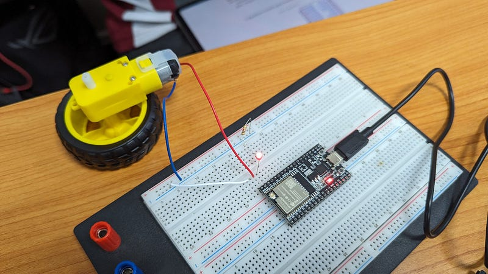

> ภาพแสดงตัวอย่างการต่อวงจรขับมอเตอร์ในการทดลองนี้ผู้เรียนจะได้ทดลองขับมอเตอร์กระแสตรง (DC Motor) และสังเกตผลที่แตกต่างระหว่างการจ่ายไฟให้มอเตอร์โดยตรง และการจ่ายไฟผ่าน MCU

ให้ลองต่อวงจรตามแบบต่อไปนี้

### แบบที่ 1 ต่อแหล่งจ่ายไฟเข้ามอเตอร์โดยตรง — มอเตอร์หมุนหรือไม่

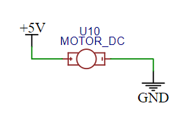

> ภาพแสดงการต่อแหล่งจ่ายไฟเข้ากับมอเตอร์โดยตรง

### แบบที่ 2 ขับมอเตอร์ด้วยขา GPIO ของ MCUวงจรเปรียบเทียบการขับมอเตอร์ด้วยขา MCU กับการต่อไฟตรง

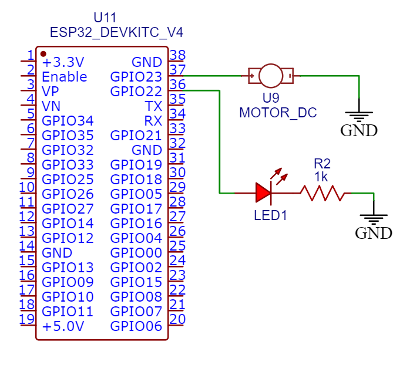

> ภาพแสดงมอเตอร์จะถูกขับโดยขา GPIO ของ MCU

สำหรับแบบที่ 2 ให้ลองดังนี้
- ต่อ LED เพิ่ม 1 ดวงเพื่อดูสถานะติดดับของขา GPIO
- เขียนโปรแกรมเพื่อเปิด/ปิดมอเตอร์ และ LED ทุก ๆ 5 วินาที ตามตัวอย่างต่อไปนี้


```c
#define MOTOR 23  
#define LED 22  
  
void setup()  
{  
 pinMode(MOTOR, OUTPUT);  
 pinMode(LED, OUTPUT);  
}  
  
void loop()  
{  
 digitalWrite(MOTOR, HIGH);  
 digitalWrite(LED, HIGH);  
 delay(5000); // Wait for 5000 millisecond(s)  
 digitalWrite(MOTOR, LOW);  
 digitalWrite(LED,LOW);  
 delay(5000); // Wait for 5000 millisecond(s)  
}
```
ลองสั่งให้โปรแกรมทำงาน และสังเกตุสิ่งที่เกิดขึ้น มอเตอร์ที่ต่อกับขา MCU หมุนเร็วเท่ากับตัวที่ต่อไฟตรงหรือไม่

### ประเด็นการเรียนรู้

1. ขาของ MCU มีหน้าที่สร้าง “สัญญาณ” ไม่ใช่ส่ง “พลังงาน” ดังนั้นแม้จะให้แรงดัน 3.3V แต่กระแสที่จ่ายได้มักจำกัด ในกรณีของ ESP32 กระแสที่ส่งออกมาได้จำกัดที่ 40 mA ซึ่งหากเทียบกับกระแสสูงสุดที่มอเตอร์นี้รับได้ที่ 3.3V ซึ่งคือ ~150 mA แสดงว่าพลังงานที่ส่งออกไปไม่เพียงพอ และทำให้มอเตอร์หมุนช้ากว่าการต่อไฟตรง หรือบางกรณีอาจจะไม่หมุนเลย
2. แต่ข้อดีของใช้ขา MCU คือเราสามารถควบคุมการทำงานผ่านโปรแกรมได้ เช่น ในตัวอย่างนี้เราเปิดปิดมเตอร์ทุก ๆ 5 วินาที ดังนั้นจะดีไม่น้อยถ้าสามารถกำจัดข้อจำกัดเรื่องกระแสที่น้อยเกินไปนี้ได้ เราจะแก้ปัญหานี้ในปฏิบัติการถัดไป

## การส่งงาน
- ส่งภาพวงจรและเขียนอธิบายผล

---

## Lab 2.2 การขับโหลดด้วย Transistor

Transistor เป็นสวิทช์ที่ใช้สารกึ่งตัวนำ ที่มีคุณสมบัติสำคัญคือสามารถผ่านกระแสไปยังโหลดได้มากกว่ากระแสที่ใช้กระตุ้นตัว Transistor เอง

Transistor แบบ NPN เป็นชนิดที่ได้รับความนิยมแพร่หลาย กระตุ้นการทำงานด้วย Logic High ที่ขา Base ซึ่งจะใช้ในการทดลองนี้

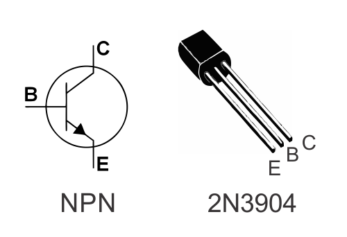

> ตัวอย่าง Transistor แบบ NPNในภาพข้างต้นจะเห็นว่า Transistor มีขา 3 ขา ประกอบด้วย

* Collector (C ) เป็นขาที่รับพลังงานจากแหล่งภายนอก
* Emitter (E) เป็นขาที่จ่ายพลังงานไปสู่วงจรภายนอก
* Base (B) เป็นขาที่ควบคุมการไหลของกระแสว่าจะสามารถไหลจาก Collector ไปยัง Emitter ได้หรือไม่ โดย NPN Transistor จะมีสถานะ “เปิด” คือยอมให้กระแสไหลเมื่อขา Base เป็น High

### วงจรขับ Transistor อย่างง่ายแบบ Low side

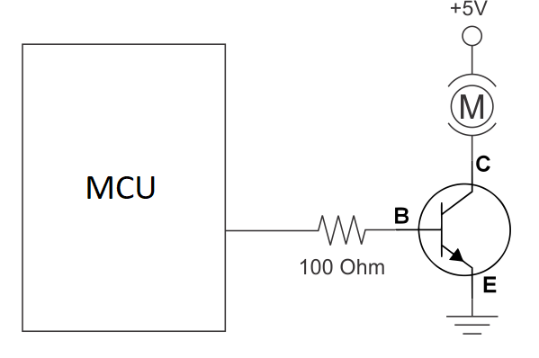

> แสดงวงจรขับแบบ low-sideวงจรข้างต้นจะต่อโหลด (มอเตอร์ — สัญลักษณ์ตัว M) ฝั่งหนึ่งเข้ากับไฟเลี้ยง และอีกฝั่งเข้ากับ Ground ผ่าน Transistor โดยมอเตอร์จะหมุนเมื่อ Transistor นี้ทำงาน

ขา Base ของ Transistor ต่อเข้ากับขาของ MCU ผ่านตัวต้านทาน เมื่อขา MCU นี้มีสถานะเป็น high ก็จะทำให้ Transistor ทำงาน


> Tip: ตัวต้านทานที่ขา Base ของ Transistor ไม่จำเป็นต้องมีเสมอไป หน้าที่หลักในที่นี้คือลดกระแสที่ใช้ในการกระตุ้นขา Base ไม่ให้มากเกินความจำเป็น (เปลืองไฟ)

ให้ลองต่อวงจรใน Schematic ข้างต้นเพิ่มเติมในวงจรจาก Lab ก่อนหน้า โดยใช้ขา GPIO23 ในการขับ Transistor

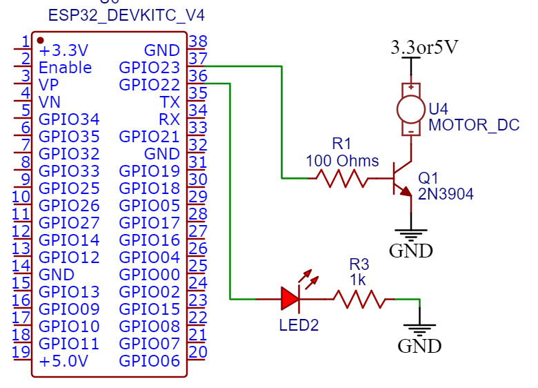

> วงจรขับมอเตอร์ด้วย Transistorลองเปรียบเทียบดูว่ามอเตอร์เปิดปิดทุกตามเวลาที่กำหนดหรือไม่ และหมุนเร็วขึ้นกว่าเดิมหรือไม่

### ประเด็นเรียนรู้

* เนื่องจาก Transistor NPN โดยทั่วไปนำกระแสได้มากว่ากระแสที่ MCU จ่ายได้ โดยกระแสสูงสุดของ Transistor แต่ละรุ่นจะไม่เท่ากัน ต้องดูจาก Datasheet (2N3904 = 625 mW/200 mA) ดังนั้นเมื่อ Transistor ทำงานจึงสามารถจ่ายกระแสสูงสุดที่มอเตอร์ต้องการได้ และทำให้มอเตอร์หมุนที่ความเร็วทัดเทียมกับการต่อไฟตรง
* ดังนั้นวิธีการนี้จึงช่วยแก้ปัญหากระแสที่จำกัดของขา MCU ได้
* โหลดชนิดอื่นที่มีความต้องการกระแสมากขึ้น ก็จะต้องเลือกใช้ Transistor ที่มีคุณสมบัติเหมาะสม

## การส่งงาน
- ส่งภาพวงจรและเขียนอธิบายผล

---

## Lab 2.3 การใช้ Transistor Array

[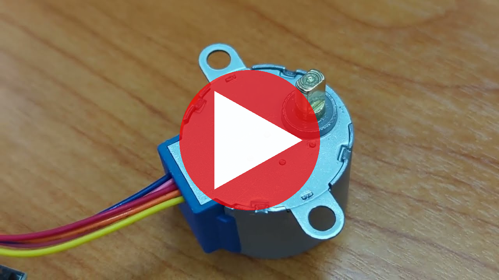](https://www.youtube.com/watch?v=MS4ux5BFwv8)

> YouTube Video - Click to play

ตัวอย่างการทำงานของ Stepping Motorในงานที่จำเป็นต้องใช้ Transistor จำนวนมาก ตัวเลือกที่นิยมคือการใช้ Transistor Array แทน Discrete Transistor (Transistor แยกเป็นตัว ๆ) โดย Transistor Array มักจะมาใน IC วงจรรม ทำให้ สามารถประหยัดพื้นที่ และใน IC มักมีอุปกรณ์เสริมที่มีประโยชน์ให้ในตัว ดังแสดงในตัวอย่าง IC หมายเลข ULN2003AN ต่อไปนี้

### ULN2003AN — 7 Channel Transistor Array (Or Driver)

IC นี้ทำหน้าที่เป็น Low-side driver โดยมีคุณสมบัติดังนี้

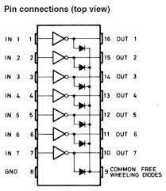ULN2003AN Transistor Array* Low-side Driver 7 ช่อง


> * รองรับกระแสช่องละ 500 mA (รวมกระแสที่ผ่าน IC ทั้งหมดไม่เกิน 2.5 A)

* มี Clamping Diode ในตัวทุกช่อง (ลด Noise จากการเปิด/ปิดอุปกรณ์เหนี่ยวนำ เช่น มอเตอร์, รีเลย์)

### การใช้งาน

ภาพต่อไปนี้แสดงตัวอย่างการขับมอเตอร์ผ่าน driver ช่องที่ 1 ของ IC โดยจะต่อไฟเข้า มอเตอร์ฝั่งหนึ่ง แล้วอีกฝั่งต่อเข้ากับขา 1C ซึ่งขา 1C นี้จะเชื่อมลง Ground ที่ต่อกับขา E ของ IC เมื่อส่งสัญญาณ high ไปที่ขา 1B

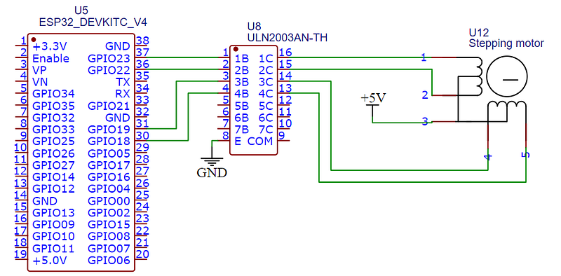

> ตัวอย่างการใช้ ULN2003 Transistor Array ขับ Stepping Motorหากพิจารณาวงจรที่อยู่ภายใน Driver แต่ละช่องของ IC นี้ ดังแสดงในภาพด้านล่าง จะเห็นว่า แต่ละช่องมีอุปกรณ์ที่เป็นประโยชน์อยู่หลายตัว เช่น

* มีตัวต้านทานขาเข้า (Rb) ในตัว
* มี Clamping Diode ระหว่างขา E และ Output C ให้ในตัว
* Transistor ภายในต่อไว้สองชั้น (เรียกว่า วงจร Darlington) ทำให้ใช้กระแสขา base น้อยมาก และมี gain สูง

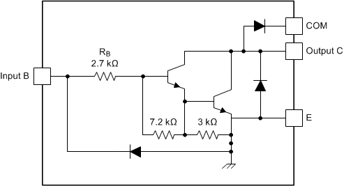

วงจรภายใน driver แต่ละช่องของ ULN2003AN

### การทดลอง

### ลองต่อวงจรขับ Stepping Motor

ให้ลองต่อวงจรและขับมอเตอร์ชนิด Stepping โดยใช้วงจรขับ ULN2003

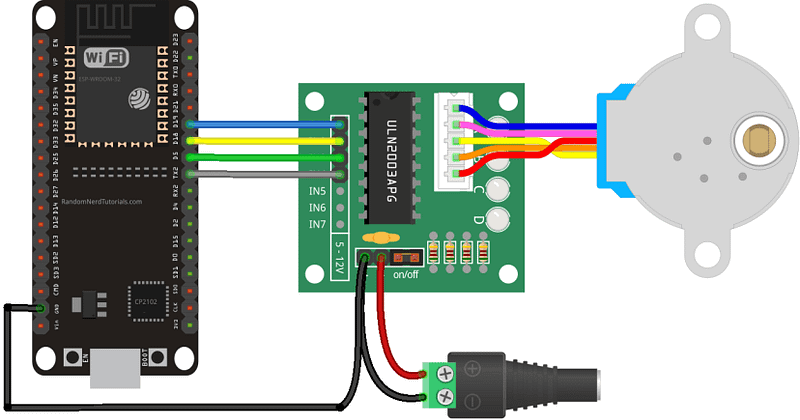

### แนะนำ Stepping Motor

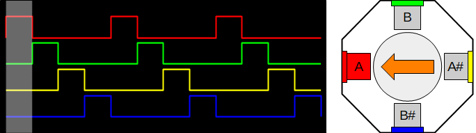

Stepping Motor เป็นมอเตอร์ที่สามารถสั่งให้หมุนเป็น Step ได้ เช่นมอเตอร์ที่ใช้ในปฏิบัติการนี้จะมีขดแม่เหล็ก 4 ขดต่อรอบ ทำให้ได้ Step ละ 90 องศา แต่เนื่องจากมอเตอร์มีการทดเฟืองจึงทำให้มุมละเอียดกว่านั้น ข้อดีของ Stepping Motor คือมีความแม่นยำสูง จึงเหมาะกับการขับอุปกรณ์เช่น หัวเครื่องพิมพ์แบบ Inkjet, เครื่องแกะ/ตัด, เครื่องพิมพ์ 3 มิติ เป็นต้น (ดู[ตัวอย่าง](https://www.youtube.com/watch?v=tBhURp_ZDik), [คำอธิบายหลักกา](https://www.youtube.com/watch?v=avrdDZD7qEQ)ร)

### โจทย์

1. ให้ต่อวงจรและเขียนโปรแกรมควบคุม ULN2003AN ให้หมุน Stepping Motor
2. เขียนโปรแกรมให้**หมุนตามเข็ม และทวนเข็ม อย่างละ 5 วินาที กลับไปมา**

### คำแนะนำ

* ให้เลือกขา GPIO 4 ขาต่อเข้ากับ ULN2003 ขอให้ตรวจสอบคู่มือ ESP32 Dev Module V4 ให้ดีว่าสามารถใช้ขาใดได้บ้าง
* Stepping Motor ที่ใช้ในปฏิบัติการใช้ไฟ 5V ซึ่งสามารถพ่วงใช้จากขา 5V ของ ESP32 ได้
* Stepping Motor นี้ใช้เฟืองทดที่ทำให้การหมุน 1 รอบต้องใช้ 2048 step
* คาบของ Pulse ที่ควบคุม Stepping Motor รุ่นนี้ต้องไม่ต่ำกว่า 2 ms นั่นคือมอเตอร์นี้หมุนได้เร็วที่สุด 500 step ต่อวินาที ดังนั้นการหมุน 1 รอบใช้เวลาประมาณ 4 วินาที — แนะนำให้ลองใช้ 5–10 ms

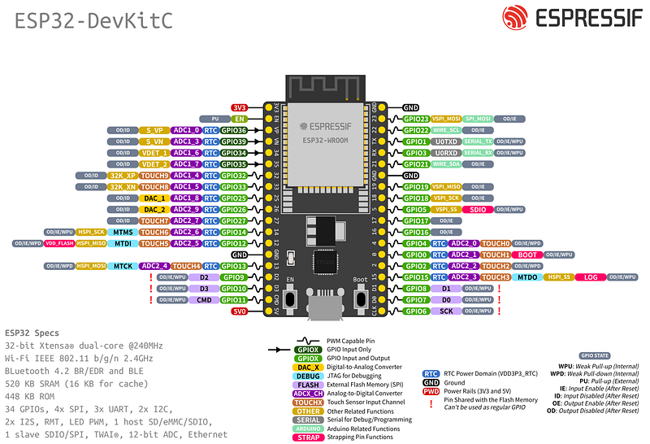

### ประเด็นเรียนรู้

1. เมื่อใดจึงควรเลือกใช้ Transistor แยกชิ้น และเมื่อใดควรใช้ Transistor Array?
2. เมื่อใดควรเลือกใช้ DC Motor และเมื่อใดถึงเลือกใช้ Stepping Motor
3. ตำแหน่งของ Stepping Motor แม่นยำ ทุกครั้งที่หมุนไปหมุนกลับ ถ้ากำหนดจำนวน step ไว้แน่นอน ตำแหน่งของมอเตอร์จะไม่คลาดเคลื่อน และแทบไม่มีการ drift เมื่อเวลาผ่านไปนาน ๆ เป็นคุณสมบัติเด่นของมอเตอร์ชนิดนี้

## การส่งงาน
- ส่งภาพ Logic Analyzer แสดง Pulse ของ signal ที่ควบคุม Stepping Motor ทั้ง 4 เส้น พร้อมภาพวงจร และคำอธิบาย

---

## Lab 2.4 การขับโหลดด้วย H-Bridge

[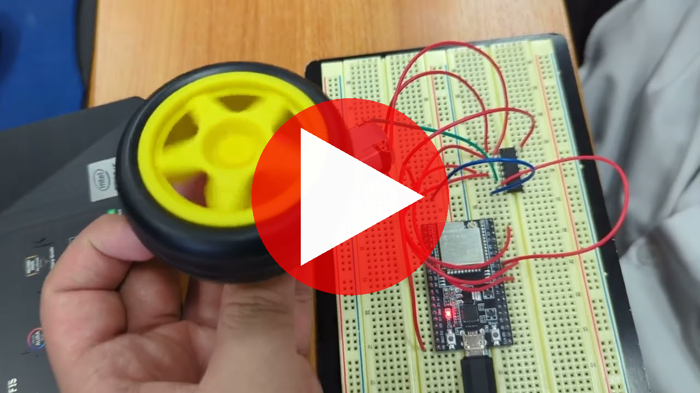](https://www.youtube.com/watch?v=Z0A0D6FUrIc)

> YouTube Video - Click to play.

ตัวอย่างการขับมอเตอร์ด้วยวงจร H-Bridge เพื่อสั่งให้มอเตอร์หมุนกลับทิศไปมาได้H-Bridge เป็นวงจรที่มีประโยชน์ในการขับโหลดที่ทำงานสลับขั้วได้ เช่น มอเตอร์กระแสตรง ซึ่งสามารถควบคุมทิศทางการหมุนได้เหมือนสลับขั้วบวกและลบ

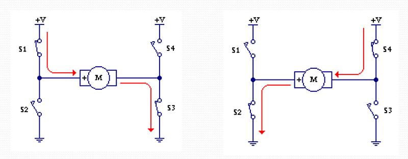

> แสดงการทำDงานของ H-Bridge ในการสลับขั้วไฟที่จ่ายให้กับโหลดหลักการทำงานของ H-Bridge คือ มีสวิท 4 จุด เป็นรูปตัว H โดยสวิททำงานเป็นคู่ตามแนวทะแยง เพื่อควบคุมขั้วของไฟที่ไหลผ่านโหลด

### วงจรรวม L293D

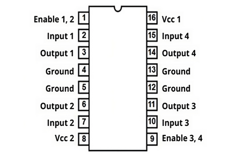วงจรรวม L293D มี H-Bridge ในตัว 2 ชุด สามารถขับมอเตอร์กระแสตรงได้ 2 ตัววงจร H-Bridge สามารถต่อแยกชิ้นเองโดยใช้ Transistor หรือใช้วงจรรวมสำเร็จรูปก็ได้ โดยแบบหลังจะเป็นทางเลือกที่ดีกว่าในแง่ความง่ายต่อการใช้งาน เพราะได้รวมชิ้นส่วนของวงจร H-Bridge ไว้ให้แล้ว

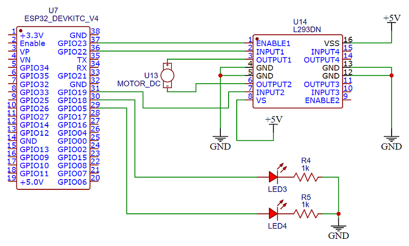

> แสดงการต่อวงจร L293D เพื่อขับมอเตอร์ โดยมี LED แสดงสถานะ 2 ดวงวงจรรวมที่จะใช้ทดสอบคือรุ่น L293D ซึ่งมีวงจร H-Bridge ในตัว 2 วงจร สามารถขับมอเตอร์ได้ 2 ตัว และควบคุมทิศทางการหมุนโดยการส่งสัญญาณ high-low ไปยังขา Input ดัง Truth Table ต่อไปนี้


> การต่อวงจร L293 ต้องมีไฟเลี้ยงทั้งขา VS และ VSS โดยในปฏิบัติการนี้ให้ต่อทั้งคู่เข้ากับ 5V

### โจทย์

ให้ลองต่อวงจรเพื่อควบคุมทิศทางการหมุนของมอเตอร์โดยใช้วงจรรวม L293D โดยให้มอเตอร์หมุนตามเข็ม สลับกับทวนเข็ม ทุก ๆ 5 วินาที และมี LED 2 ดวงที่แสดงทิศทางการหมุน ณ ขณะนั้น

### ประเด็นเรียนรู้

1. H-Bridge สร้างด้วย Transistor 4 ตัวแทน ได้หรือไม่ เพราะเหตุใด
2. Transistor Array ที่ใช้ในปฏิบัติการก่อนหน้า ไม่สามารถนำมาใช้เป็น H-Bridge ได้ อธิบายได้หรือไม่ว่าเพราะอะไร
3. โหลดแบบใดที่เหมาะใช้ H-Bridge แบบใดควรใช้ Transistor Array และแบบใดควรใช้ Transistor แยกชิ้น


