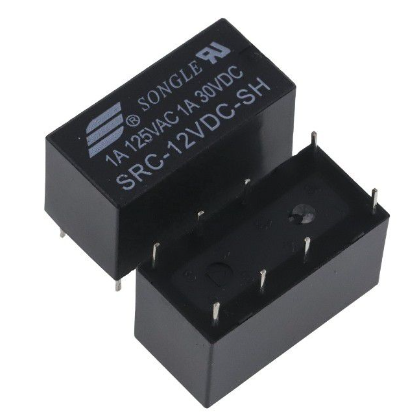
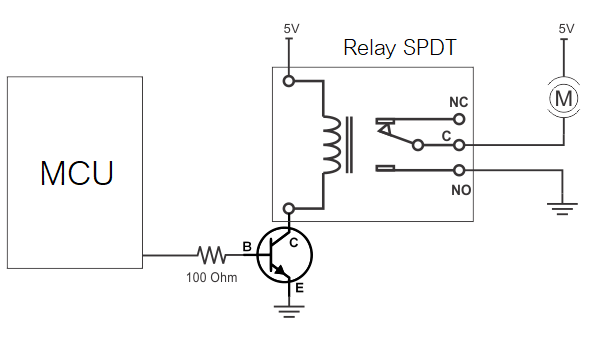
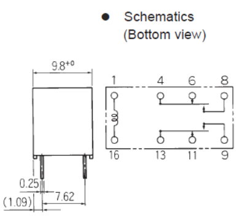
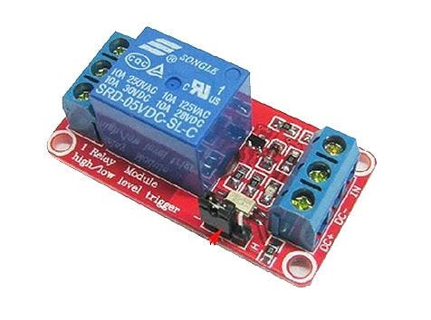
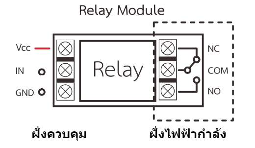
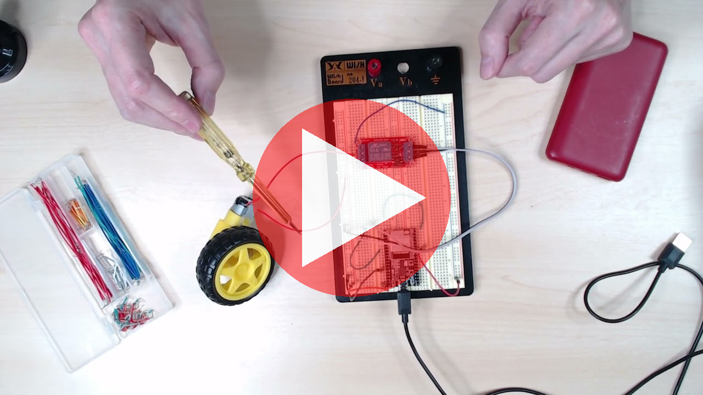
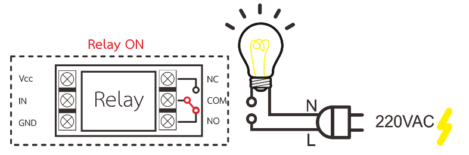
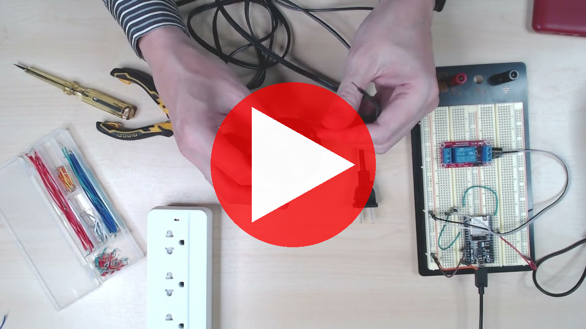
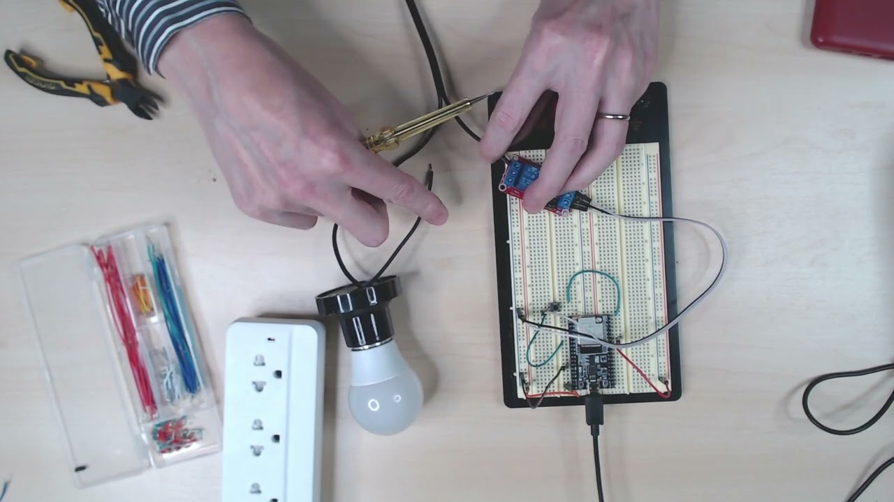

# Lab 3: ปฏิบัติการ Actuator Driver - AC loads

- [Lab 3.1 การต่อวงจร Relay เพื่อขับโหลด](#lab-31-การต่อวงจร-relay-เพื่อขับโหลด)
    - [วงจรรีเลย์อย่างง่าย](#วงจรรีเลย์อย่างง่าย)
    - [การทดลอง](#การทดลอง)
    - [ประเด็นการเรียนรู้](#ประเด็นการเรียนรู้)
- [Lab 3.2 ใช้รีเลย์โมดูลขับโหลดไฟกระแสสลับ 220VAC](#lab-32-ใช้รีเลย์โมดูลขับโหลดไฟกระแสสลับ-220vac)
    - [การทดลอง](#การทดลอง-1)
    - [แนะนำรีเลย์ และการต่อวงจรฝั่งควบคุม](#แนะนำรีเลย์-และการต่อวงจรฝั่งควบคุม)
    - [ประเด็นการเรียนรู้](#ประเด็นการเรียนรู้-1)
- [การส่งงาน](#การส่งงาน)

---

## Lab 3.1 การต่อวงจร Relay เพื่อขับโหลด

รีเลย์เป็นสวิททางกลที่ควบคุมการเปิดปิดด้วยไฟฟ้า มีประโยชน์ในการขับโหลดบางประเภทที่ Transistor ไม่สนับสนุน เช่น

- **โหลดที่ใช้กระแสสูง** — รีเลย์ขนาดเล็กราคาถูกโดยทั่วไปรองรับกระแสได้ถึง 10A ในขณะที่ Transistor ในพิกัดกระแสเดียวกันจะราคาแพงกว่ามาก
- **โหลดที่ใช้ไฟกระแสสลับ** — รีเลย์สามารถขับโหลดได้ทั้งกระแสตรงและกระแสสลับ ในขณะที่ Transistor ขับได้เฉพาะไฟกระแสตรงเท่านั้น ตัวอย่างการใช้งานไฟกระแสสลับคือการควบคุมอุปกรณ์ไฟบ้าน 220VAC

### วงจรรีเลย์อย่างง่าย

> แสดงวงจรขับโดยใช้รีเลย์อย่างง่าย

วงจรข้างต้นแสดง [รีเลย์ชนิด SPDT](https://en.wikipedia.org/wiki/Relay#Terminology) (Single Pole Double Throw) ทำหน้าที่เป็น low-side switch ขับมอเตอร์ โดยต่อขาด้านหนึ่งของมอเตอร์เข้ากับ Ground ผ่านขา Common (C) และ NO (Normally Open หรือ ปกติเปิด) ของรีเลย์

เมื่อรีเลย์ทำงาน ขา Common จะเชื่อมกับขา Normally Open ทำให้ไฟวิ่งผ่านได้

การทำงานของรีเลย์อาศัยการจ่ายไฟให้กับแม่เหล็กไฟฟ้าภายใน ที่ทำหน้าที่ดูดหน้าสัมผัสเข้าหากัน ซึ่งแม่เหล็กนี้มักต้องใช้กระแสขับสูงกว่าที่ขา MCU จะจ่ายได้ ดังนั้นจึงต้องมีการใช้ Transistor ขับแม่เหล็กไฟฟ้านี้อีกต่อหนึ่ง

### การทดลอง

ให้ต่อวงจรรีเลย์เพื่อทดลองขับมอเตอร์กระแสตรงด้วยไฟ 5V

1. ดู Datasheet ของรีเลย์ เพื่อระบุขาของอุปกรณ์ หาให้เจอว่าขาใดเป็น C, NO และ Coil
2. ใช้ Transistor สร้าง low-side driver เพื่อขับรีเลย์
3. ทดลองต่อมอเตอร์เข้ากับขาออก (C, NO)
4. เขียนโปรแกรมสั่งงานให้เปิดปิดรีเลย์ทุก 5 วินาที

> Pinout ของ Relay RY5W-K ซึ่งเป็นรีเลย์ Coil 5V แบบ DPDT

### ประเด็นการเรียนรู้

- **ได้ยินเสียงเมื่อรีเลย์ทำงานหรือไม่** — รีเลย์เป็นสวิททางกลเมื่อทำงานจะมีเสียงสับเปิดหรือปิดเสมอ  
- **ข้อดีของการใช้รีเลย์** — ผ่านกระแสได้สูงเมื่อเทียบราคาต้นทุนกับ driver ชนิดอื่น แม้ในการทดลองนี้จะไม่ได้ใช้ประโยชน์ข้อนี้ แต่ถ้าโหลดใช้กระแสสูงรีเลย์เป็นทางเลือกหนึ่งที่ดี เมื่อเทียบกับการใช้ Transistor หรือ driver ชนิดอื่น  
- **ข้อจำกัดของรีเลย์** — ความถี่ของการเปิด–ปิดจะไม่สูงนักเนื่องจากเป็นสวิททางกล การสับสวิททางกลมักเกิดสปาร์ค (Spark) ทำให้มี Noise รบกวนระบบ บางครั้งถึงกับทำให้ MCU รีเซ็ทได้  

---

## Lab 3.2 ใช้รีเลย์โมดูลขับโหลดไฟกระแสสลับ 220VAC

> แสดงตัวอย่างรีเลย์โมดูล

ข้อดีสำคัญของรีเลย์คือการขับโหลดไฟกระแสสลับ โดยเป็นวิธีขับโหลดที่ต้นทุนไม่สูงและเป็นที่นิยมใช้อย่างแพร่หลาย

> เพื่อความปลอดภัย ปฏิบัติการนี้จะใช้รีเลย์โมดูล ที่มีหัวต่อสายไฟฟ้ามาในตัว อย่างไรก็ดีขอให้ระมัดระวัง ไฟฟ้า 220VAC เป็นอันตรายต่อชีวิต ต้องให้ผู้เชี่ยวชาญตรวจสอบวงจรก่อนเสียบปลั๊กทดลองใช้

### การทดลอง

1. **ดู Datasheet ของรีเลย์โมดูล** — และระบุขาต่าง ๆ ให้ครบถ้วน

> แสดง pinout ของรีเลย์โมดูล

ฝั่งควบคุม

- Vcc, GND — ไฟเลี้ยงวงจร 5V  
- IN — ขาสัญญาณควบคุมการเปิด–ปิดรีเลย์ ต่อเข้ากับ MCU  

ฝั่งไฟฟ้ากำลัง

- COM — ไฟเข้า ปกติจะต่อกับขา Line  
- NO — ไฟออก ปกติจะส่ง Line กลับไปขับโหลด  

#### แนะนำรีเลย์ และการต่อวงจรฝั่งควบคุม

 

> YouTube Video - Click to play

2. ทดลองควบคุม DC Motor

ลองใช้รีเลย์ขับโหลดไฟกระแสตรงดู โดยกำหนดให้ขับมอเตอร์ DC

 

> YouTube Video - Click to play

3. ต่อวงจรขับหลอดไฟ

- ฝั่งไฟฟ้ากำลัง ต่อสายปลั๊กไฟฝั่งแรกเข้าโหลด อีกเส้นเข้าขา C (หรือ NO) ของรีเลย์ แล้วต่อสายอีกเส้นออกจากรีเลย์ไปยังโหลด  
- ฝั่งควบคุม ต่อวงจรเข้ากับไฟและขา GPIO ของ MCU  

 

> YouTube Video - Click to play

 

> YouTube Video - Click to play

4. ตรวจสอบและลองเขียนโปรแกรม

ให้อาจารย์หรือทีมงานตรวจสอบความถูกต้องของวงจร ก่อนเสียบปลั๊กไฟเสมอ เพื่อป้องกันอันตราย

ลองเขียนโปรแกรมให้เปิด–ปิดไฟทุก ๆ 5 วินาที

### ประเด็นการเรียนรู้

- **รีเลย์โมดูลเป็นวงจรที่ใช้งานสะดวก** — เพราะรวมวงจรขับ, รีเลย์, และมีหัวต่อสายให้สำเร็จในตัว  
- **รีเลย์ขับไฟกระแสสลับได้** ในขณะที่ Transistor จะขับเฉพาะกระแสตรงเท่านั้น เรื่องนี้จึงเป็นจุดเด่นของรีเลย์  
- **อายุใช้งานรีเลย์** — Spec โดยทั่วไปจะเปิดปิดได้ประมาณ 100,000 ครั้ง ดังนั้นจะสามารถคำนวณอายุการใช้งานได้ถ้ารู้จำนวนครั้งการเปิด–ปิดต่อวัน  

## การส่งงาน
- ให้ส่ง Video แสดงวงจรรีเลย์และผลการควบคุมหลอดไฟ