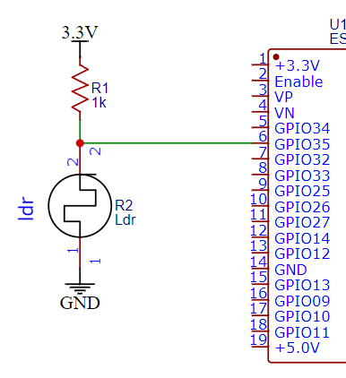
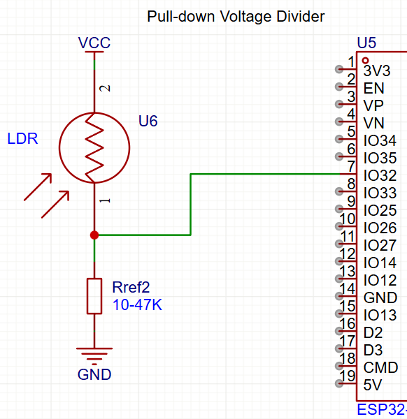
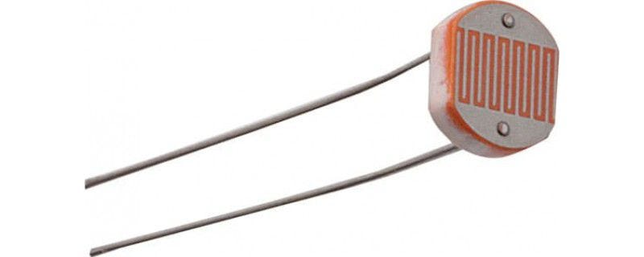
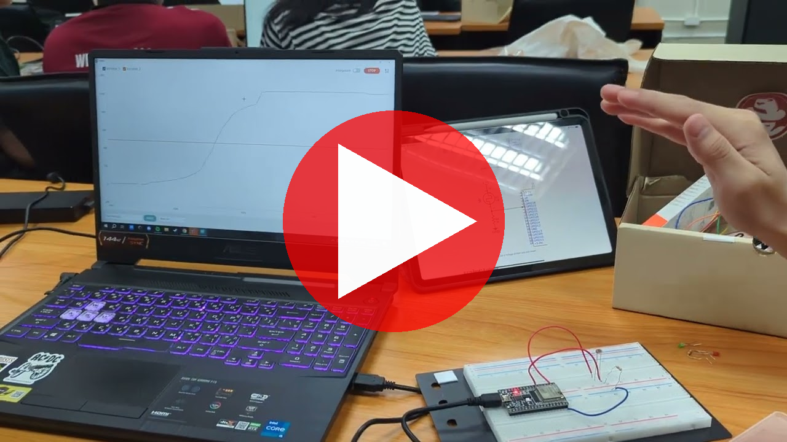
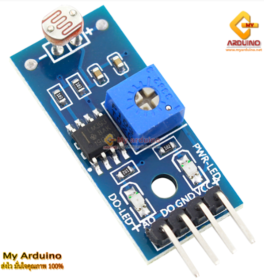
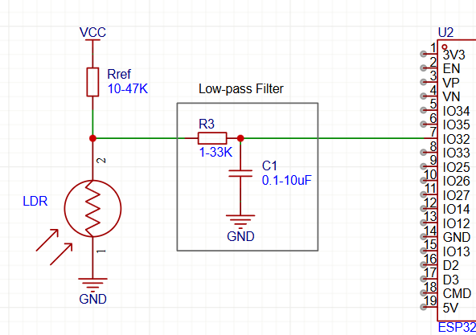


# Lab 4: การเชื่อมต่อเซ็นเซอร์

---
## การส่งรายงาน 

### Lab 4.1 แสดงภาพแสดงขั้นตอนการทำ Lab พร้อมบรรยายให้เข้าใจ ##

    - การต่อวงจรแบบ Pull-up - แสดงภาพวงจรและเส้นกราฟ 
    - การต่อวงจรแบบ Pull-down - แสดงภาพวงจรและเส้นกราฟ
    - อภิปรายความรู้ที่นักศึกษาได้รับจากการทดลองนี้

### Lab 4.2 แสดงภาพแสดงขั้นตอนการทำ Lab พร้อมบรรยายให้เข้าใจ ###

    ส่งภาพกราฟเปรียบเทียบค่าเซ็นเซอร์ที่ได้จากการต่อทั้ง 4 รูปแบบ 
      - ไม่ใช้ Hysteresis
      - ใช้ Hysteresis
      - ใช้ Hardware Low-pass filter
      - ใช้ Software Low-pass filter

    อภิปรายความรู้ที่นักศึกษาได้รับจากการทดลองนี้

# Table of Contents

- [Lab 4: การเชื่อมต่อเซ็นเซอร์](#lab-4-การเชื่อมต่อเซ็นเซอร์)
  - [4.1 การใช้เซ็นเซอร์อะนาลอกแบบความต้านทาน (Resistance-based Analog Sensors)](#41-การใช้เซ็นเซอร์อะนาลอกแบบความต้านทาน-resistance-based-analog-sensors)
    - [วงจรแบ่งแรงดัน (Voltage Divider)](#วงจรแบ่งแรงดัน-voltage-divider)
    - [ภาพวงจร](#ภาพวงจร)
      - [Pull-up - ตัวต้านทานเชื่อมเข้ากับ +V](#pull-up-ตัวต้านทานเชื่อมเข้ากับ-v)
      - [Pull-down - ตัวต้านทานต่อลง GND](#pull-down-ตัวต้านทานต่อลง-gnd)
    - [การเลือกค่า Rref](#การเลือกค่า-rref)
    - [การอ่านค่า ADC ด้วย Arduino](#การอ่านค่า-adc-ด้วย-arduino)
    - [การใช้ Serial Plotter](#การใช้-serial-plotter)
      - [รูปแบบข้อมูล](#รูปแบบข้อมูล)
      - [ตัวอย่างโค้ดส่งกราฟ 2 เส้น](#ตัวอย่างโค้ดส่งกราฟ-2-เส้น)
    - [โจทย์](#โจทย์)
    - [ประเด็นเรียนรู้](#ประเด็นเรียนรู้)
    
  - [4.2 Hysteresis & Low-pass Filter - วิธีป้องกันไม่ให้เกิดการเปลี่ยน State ถี่เกินไป](#42-hysteresis-low-pass-filter-วิธีป้องกันไม่ให้เกิดการเปลี่ยน-state-ถี่เกินไป)
  - [ตัวอย่าง - โคมไฟอัตโนมัติ](#ตัวอย่าง-โคมไฟอัตโนมัติ)
    - [การทำงาน](#การทำงาน)
    - [ให้แสดงกราฟ](#ให้แสดงกราฟ)
    - [โจทย์](#โจทย์-1)
      - [1) ลองไม่ใช้ hysteresis](#1-ลองไม่ใช้-hysteresis)
      - [2) ลองใช้ **Hysteresis**](#2-ลองใช้-hysteresis)
      - [3) ลองใช้ **Hardware Low-pass filter**](#3-ลองใช้-hardware-low-pass-filter)
      - [4) ลองใช้ **Software Low-pass filter**](#4-ลองใช้-software-low-pass-filter)

---

## 4.1 การใช้เซ็นเซอร์อะนาลอกแบบความต้านทาน (Resistance-based Analog Sensors)

เซ็นเซอร์อะนาลอกที่เปลี่ยนค่าความต้านทานตามสิ่งที่วัด เช่น  
- **LDR (Light-dependent Resistor)** – เปลี่ยนตามความเข้มแสง  
- **Thermistor** – เปลี่ยนตามอุณหภูมิ  

---

### วงจรแบ่งแรงดัน (Voltage Divider)

MCU วัดค่าแรงดันได้เท่านั้น ต้องใช้วงจรแบ่งแรงดันเพื่อแปลงความต้านทานเป็นแรงดัน

**Pull-up formula**
```
Vadc = Vcc * (Rsensor) / (Rsensor + Rref)
```

**Pull-down formula**
```
Vadc = Vcc * (Rref) / (Rsensor + Rref)
```

> pull-up ค่าแรงดันเพิ่มตาม Rsensor  
> pull-down ค่าแรงดันลดลงตาม Rsensor

### ภาพวงจร
#### Pull-up - ตัวต้านทานเชื่อมเข้ากับ +V




#### Pull-down - ตัวต้านทานต่อลง GND



---

### การเลือกค่า Rref

ต้องรู้ช่วงค่าความต้านทานของเซ็นเซอร์ก่อน  
เลือกค่า Rref ให้เหมาะสมเพื่อให้เกิดความแตกต่างของแรงดันมากพอสำหรับ ADC
> โดยปกติค่า Rref จะอยู่ระหว่าง 10-47K

---

### การอ่านค่า ADC ด้วย Arduino

```c
#define LDR 32    // Change this to the GPIO you are using

int LDR_Value = 0;

void setup() {
  Serial.begin(9600);
}

void loop() {
  LDR_Value = analogRead(LDR);
  Serial.println(LDR_Value);
  delay(100);
}
```

---

### การใช้ Serial Plotter

#### รูปแบบข้อมูล

ข้อมูลตัวเดียว:
```
ชื่อ:ค่า
```

หลายข้อมูล:
```
ชื่อ1:ค่า,ชื่อ2:ค่า,...
```

#### ตัวอย่างโค้ดส่งกราฟ 2 เส้น

```c
#define LDR 32
int LDR_Value = 0;
int static_variable = 500;

void setup() {
  Serial.begin(9600);
}

void loop() {
  LDR_Value = analogRead(LDR);

  Serial.print("Variable_1:");
  Serial.print(LDR_Value);
  Serial.print(",");
  Serial.print("Variable_2:");
  Serial.println(static_variable);
  delay(20);
}
```


---

### โจทย์

ต่อ LDR ด้วยวงจร pull-up และ pull-down แล้วเปรียบเทียบพฤติกรรมค่าเซ็นเซอร์



**วิดีโอประกอบ**  

[](https://www.youtube.com/watch?v=oHzir-ILy1E)

> YouTube Video - Click to play


---

### ประเด็นเรียนรู้
- ไม่ใช่ทุก GPIO รับสัญญาณ ADC ได้  
- Pull-up / pull-down ต่างกันอย่างไร  
- เซ็นเซอร์ความต้านทานอื่น ๆ มีอีกหลายชนิด เช่น Thermistor, Soil moisture  
- โมดูลเซ็นเซอร์สำเร็จรูปมักมีวงจร buffer—ส่งค่าออกมาเป็นแรงดัน ดังนั้นต่อตรง ADC ได้เลย  



ภาพตัวอย่าง โมดูลเซ็นเซอร์แสงแบบสำเร็จรูปที่มีวงจร Buffer ในตัว และส่งค่าออกมาเป็น Voltage สามารถต่อตรงกับ ADc โดยไม่ต้องใช้ Pull-up หรือ Pull-down


---

## 4.2 Hysteresis & Low-pass Filter - วิธีป้องกันไม่ให้เกิดการเปลี่ยน State ถี่เกินไป

## ตัวอย่าง - โคมไฟอัตโนมัติ

### การทำงาน
- ใช้เซ็นเซอร์แสงควบคุมการติดดับของ LED
- ถ้ามืด → เปิด LED  
- ถ้าสว่าง → ปิด LED  
- ต้องกำหนดค่า threshold  

### ให้แสดงกราฟ
- เส้นที่ 1 = ค่าเซ็นเซอร์แสง  
- เส้นที่ 2 = ค่า Threshold ที่เลือก
- เส้นที่ 3 = สถานะไฟ (0 = ปิด, 100 = เปิด)

---

### โจทย์

#### 1) ลองไม่ใช้ hysteresis
- ใช้ค่าเซ็นเซอร์ค่าเดียวในการเปิด-ปิด LED
- ให้สังเกตุว่าจะเกิดไฟกระพริบ (flickering) เมื่อค่าแสงใกล้ threshold ซึ่งเป็นพฤติกรรมที่ไม่พึงประสงค์ในระบบควบคุม
- สังเกตุกราฟ

#### 2) ลองใช้ **Hysteresis**
- เพิ่ม guard band แยกค่า threshold ON กับ OFF
- ปัญหา flickering ของ LED น่าจะหายไป
- สังเกตุกราฟ

#### 3) ลองใช้ **Hardware Low-pass filter**
- เอา Hysteresis ออก
- ต่อวงจร Low-pass โดยลองตัวต้านทาน 1 K Ohms และ capacitor 10 µF ที่ ADC input → ค่าที่อ่านจะนิ่งขึ้น
- สังเกตุกราฟ
- ลองเปลี่ยนค่า R กับ C แล้วสังเกตุผล 




#### 4) ลองใช้ **Software Low-pass filter**
- เอา R, C ออก
- ลองเขียน Low-pass filter ในโปรแกรม ดังตัวอย่างต่อไปนี้
- ลองปรับค่า Weight แล้วสังเกตุผล

```c
// Low-pass filter variables
const int SENSOR_PIN = A0;
int PrevOutput = 0;
const int Weight = 4;   // Adjust as needed

void setup() {
  Serial.begin(9600);
}

void loop() {
  int NewInput = analogRead(SENSOR_PIN);

  int Output = (NewInput + (Weight * PrevOutput)) / (Weight + 1);

  Serial.print("Output = ");
  Serial.println(Output);

  PrevOutput = Output;

  delay(50);
}

```

