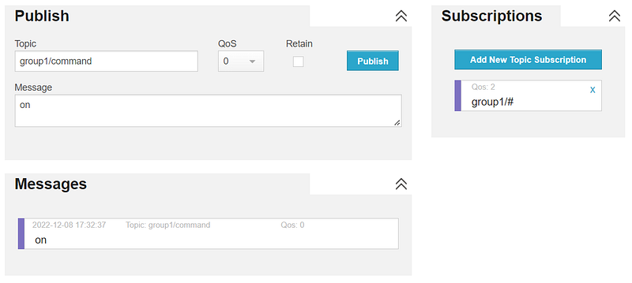
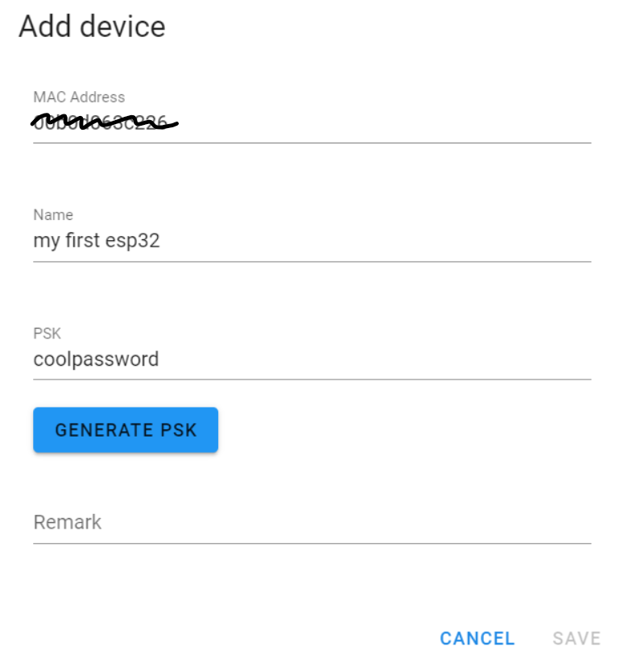
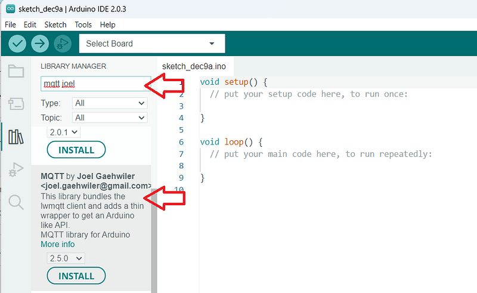
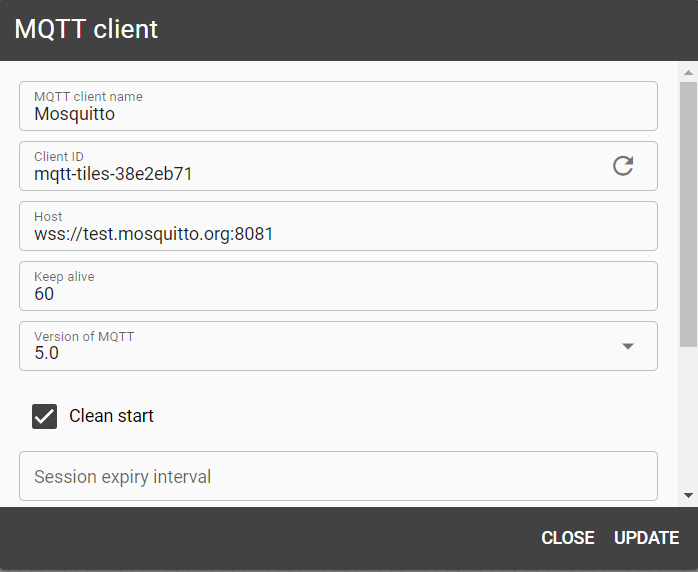
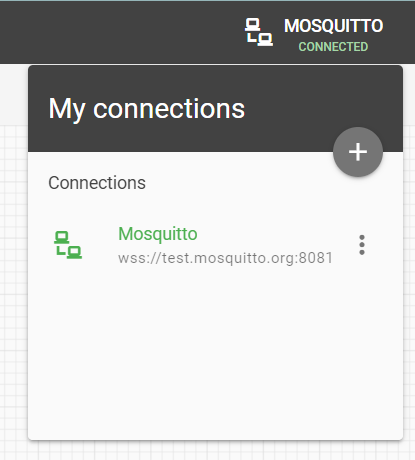
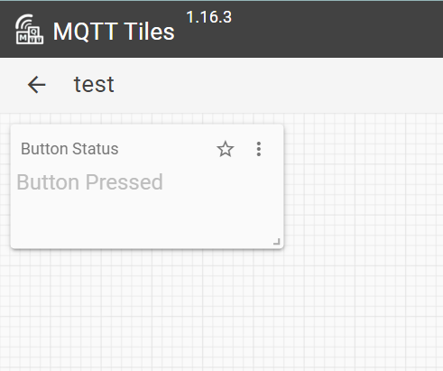
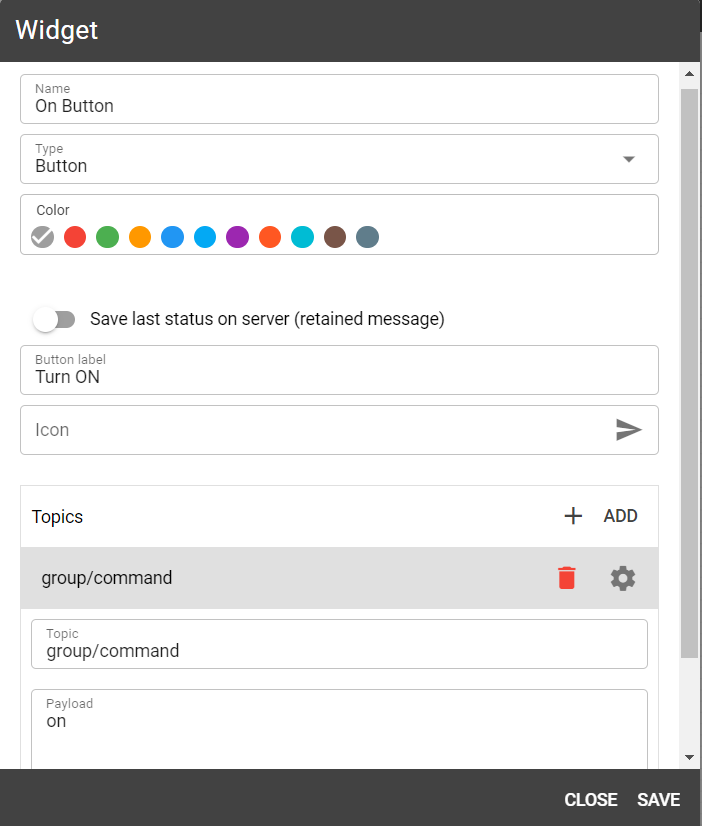

# การสื่อสารไร้สายสำหรับสมองกลฝังตัวผ่าน MQTT


ในปฏิบัติการนี้จะแสดงให้วิธีการใช้ MQTT ในการสื่อสารระหว่างระบบสมองกลฝังตัว และ Web Application ตามขั้นตอนต่อไปนี้

  1. ศึกษาหลักการทำงานของ MQTT
  2. ฝึกต่อ ESP32 เข้ากับระบบเครือข่าย
  3. ฝึกเขียนโปรแกรมสมองกลฝังตัวเพื่อรับและส่งค่าผ่าน MQTT
  4. ฝึกสร้าง Dashboard ที่ใช้แสดงค่า และควบคุมการทำงานของสมองกล

## Table of Contents
- [การสื่อสารไร้สายสำหรับสมองกลฝังตัวผ่าน MQTT](#การสื่อสารไร้สายสำหรับสมองกลฝังตัวผ่าน-mqtt)
- [1. ทดลองศึกษาการทำงานของ MQTT](#1-ทดลองศึกษาการทำงานของ-mqtt)
  - [หลักการของ MQTT Broker, การ publish และ การ Subscribe](#หลักการของ-mqtt-broker-การ-publish-และ-การ-subscribe)
  - [การทดลอง](#การทดลอง)
    - [ทดลอง subscribe topic ใน Web Client](#ทดลอง-subscribe-topic-ใน-web-client)
    - [ทดลอง publish ไปยัง topic ใน Web Client](#ทดลอง-publish-ไปยัง-topic-ใน-web-client)
  - [โจทย์](#โจทย์)
  - [ประเด็นการเรียนรู้](#ประเด็นการเรียนรู้)
- [2. การต่อ ESP32 เข้ากับระบบเครือข่าย](#2-การต่อ-esp32-เข้ากับระบบเครือข่าย)
  - [การทดลอง 2 เชื่อมต่อ ESP32 เข้ากับ WiFi](#การทดลอง-2-เชื่อมต่อ-esp32-เข้ากับ-wifi)
- [3. เขียนโปรแกรมสมองกลฝังตัวเพื่อรับและส่งค่าผ่าน MQTT](#3-เขียนโปรแกรมสมองกลฝังตัวเพื่อรับและส่งค่าผ่าน-mqtt)
  - [3.1 ติดตั้ง MQTT library ให้กับ Arduino IDE](#31-ติดตั้ง-mqtt-library-ให้กับ-arduino-ide)
  - [3.2 รวบรวมข้อมูลเกี่ยวกับ MQTT Broker เพื่อใช้ในโปรแกรม](#32-รวบรวมข้อมูลเกี่ยวกับ-mqtt-broker-เพื่อใช้ในโปรแกรม)
  - [3.3 ทดลองเขียนโปรแกรม เพื่อให้ ESP32 สามารถ Publish และ Subscribe MQTT ได้](#33-ทดลองเขียนโปรแกรม-เพื่อให้-esp32-สามารถ-publish-และ-subscribe-mqtt-ได้)
  - [3.4 การทดลอง](#34-การทดลอง)
    - [A. รายงานสถานะปุ่ม](#a-รายงานสถานะปุ่ม)
    - [B. ควบคุมไฟ LED จาก Web Client](#b-ควบคุมไฟ-led-จาก-web-client)
  - [ประเด็นการเรียนรู้](#ประเด็นการเรียนรู้-1)
- [4. การสร้าง MQTT Dashboard](#4-การสร้าง-mqtt-dashboard)
  - [4.1 เข้าใช้งาน MQTT Tiles และเชื่อมต่อ MQTT](#41-เข้าใช้งาน-mqtt-tiles-และเชื่อมต่อ-mqtt)
  - [4.2 ทดลองสร้าง Dashboard เพื่อแสดงค่าจาก ESP32](#42-ทดลองสร้าง-dashboard-เพื่อแสดงค่าจาก-esp32)
  - [4.3 เพิ่ม Widget ควบคุมการทำงานของ ESP32](#43-เพิ่ม-widget-ควบคุมการทำงานของ-esp32)
  - [ประเด็นการเรียนรู้](#ประเด็นการเรียนรู้-2)
- [การส่งงาน](#การส่งงาน)


## 1. ทดลองศึกษาการทำงานของ MQTT


> ภาพแสดงโครงสร้างพื้นฐานของการสื่อสารด้วย MQTT

### หลักการของ MQTT Broker, การ publish และ การ Subscribe

MQTT (Message Queuing Telemetry Transport) เป็นแนวทางการสื่อสารระหว่างอุปกรณ์ที่ได้รับความนิยมอย่างสูงโดยเฉพาะกับงานด้าน IoT (Internet of Things) ที่ส่วนประกอบสำคัญคือ

  1. **MQTT Broker** — ทำให้ที่เป็น server ตัวกลางในการรับส่งข้อมูลระหว่างต้นทางกับปลายทาง
  2. **Publisher** — คืออุปกรณ์ที่ส่งค่าผ่านทาง MQTT
  3. **Subscriber** — คืออุปกรณ์ที่รับค่าจาก MQTT


เช่น หากต้องการเฝ้าติดตามระดับฝุ่นควัน PM2.5 ในเมือง โดยมีเซ็นเซอร์กระจายอยู่ตามจุดต่างๆ ของเมืองนั้น สมองกลที่ต่ออยู่กับเซ็นเซอร์จะทำหน้าที่เป็น Publisher ทำการ publish ค่าฝุ่นที่วัดได้ไปยัง MQTT Broker โดยหากต้องการบันทึกข้อมูลนี้ลงฐานข้อมูล เครื่องคอมพิวเตอร์ที่ต่อฐานข้อมูลอยู่ก็จะ Subscribe ค่านี้จาก MQTT Broker เพื่อให้ Broker ส่งต่อข้อมูลให้ทุกครั้งที่เซ็นเซอร์ส่งค่ามา เป็นต้น

หมายเหตุ อุปกรณ์หนึ่ง ๆ อาจเป็นทั้ง Publisher และ Subscriber ก็ได้ เช่น หากเซ็นเซอร์วันฝุ่นมีการต่อสัญญาณไฟเตือนภัยไว้ด้วย คอมพิวเตอร์ศูนย์กลางก็สามารถ publish คำสั่งให้เปิดไฟเตือน โดยระบบสมองกลก็จะ subscribe เพื่อรับคำสั่งนั้น เป็นต้น

**MQTT Topic**

การรับ-ส่งค่าผ่าน MQTT Broker จะทำผ่าน Topic ซึ่งสามารถแบ่งลำดับขั้นของหัวข้อได้ตามรูปแบบต่อไปนี้

> topic/sub-topic1/sub-topic2/…

หัวข้อแต่ละระดับจะถูกแบ่งด้วยเครื่องหมาย “/” เช่น ตัวอย่างฝุ่น PM2.5 ข้างต้นอาจ publish ไปยังหัวข้อที่ชื่อ

> pm25/node1

โดยคอมพิวเตอร์ที่รับค่านี้ก็จะต้อง Subscribe หัวข้อเดียวกันนี้ด้วย โดยหากมีหลายหัวข้อในระดับเดียวกันก็สามารถใช้สัญลักษณ # เพื่อ subscribe ทุกหัวข้อในระดับนั้น ๆ ได้เช่น

> pm25/#

หากในระบบมีเซ็นเซอร์หลายโหนด เครื่องรับก็จะได้รับค่าจากทุกโหนด ขอเพียงให้แต่ละโหนดส่งมาใต้ Topic ที่ชื่อ pm25/

### การทดลอง

การทดลอง 1 เชื่อม Web Client เข้ากับ MQTT Server

ให้จับคู่กับเพื่อน หรือใช้สองอุปกรณ์ในการส่งข้อความหากันผ่าน MQTT


> ภาพแสดงการเชื่อมต่อ MQTT Broker โดยใช้ Web Client

  * **MQTT Web Client** — เราจะใช้ MQTT Client ที่ชื่อ HiveMQ เพื่อทดลองรับ-ส่งข้อมูล  
<http://www.hivemq.com/demos/websocket-client/>
  * **MQTT Server** — ใน HiveMQ ให้กรอกข้อมูล MQTT Broker ดังนี้  
Server: test.mosquitto.org  
Port: 8081   
SSL: Yes  
Username/Password: ไม่ใช้  
ClientID: ใช้ค่า default ที่ระบบกำหนดให้ ค่านี้ใช้ระบุ Client มีค่าเป็นอะไรก็ได้ โดยแต่ละ user จะต้องไม่ซ้ำกัน


test.mosquitto.org เป็น Public Broker สามารถเข้าใช้ได้ฟรี และไม่ต้องระบุตัวตน เหมาะกับการทดลองและทดสอบ แต่ในกรณีที่จะใช้งานจริง แนะนำให้เปิดบริการ MQTT Broker ของตนเอง (เช่น Mosquitto ซึ่งเป็น MQTT Server ที่นิยมสูงตัวหนึ่ง) โดยการติดตั้งในเครื่องของตน หรือหาใช้ Cloud Service

### ทดลอง subscribe topic

ใน Web Client ให้ลอง subscribe topic ที่กำหนดขึ้น เช่น group1/# เพื่อรับข้อความใด ๆ ที่ส่งมายัง topic “group1”


> แสดงตัวอย่างการ subscribe

### ทดลอง publish ไปยัง topic

ใน Web Client ให้ลอง publish ค่าไปยัง topic ที่ subscribe ไว้ข้างต้น



> แสดงตัวอย่างการ publish หาตัวเอง

ในภาพแสดงการ Publish ไปยัง topic “group1/command” โดยมี payload คือคำว่า “on” และเนื่องจากมีการ subscribe topic “group1/#” ค่าที่ publish จึงแสดงในส่วนของ Messages ด้านล่างด้วย

### โจทย์

  * ให้ใช้วิธีข้างต้นสร้าง Group Chat โดยให้หลาย ๆ คน (หรือหลาย ๆ device) ส่งข้อความเข้ามาใน Topic เดียวกัน


### ประเด็นการเรียนรู้

  * เข้าใจหลักการ publish และ subscribe
  * เห็นข้อดีของการสื่อสารแบบนี้ — ทำไมเราไม่ส่งข้อมูลตรงจากต้นทางไปยังปลายทางเลย ทำไมต้องใช้ตัวกลาง วิธีนี้มีข้อดีอย่างไร ทำไมจึงนิยมใช้
  * MQTT Client มีหลายหลายรูปแบบให้ใช้ — มีทั้งโปรแกรมสำเร็จรูป และมีทั้ง code library
  * MQTT Server มีหลายรูปแบบเช่นกัน — สามารถใช้ Public Broker เช่นข้างต้นเพื่อทดสอบ แต่ถ้าจะใช้กับงานจริง ๆ ควรตั้ง server เอง หรือใช้บริการบน cloud


---

## 2. การต่อ ESP32 เข้ากับระบบเครือข่าย

การทดลอง 2 เชื่อมต่อ ESP32 เข้ากับ Wifi

ESP32 มี Wifi ในตัว ซึ่งสามารถเขียนโปรแกรมเพื่อต่อเข้ากับ Access Point ได้โดยง่ายดังโปรแกรมตัวอย่างต่อไปนี้
    
```c
    #include <WiFi.h>  
      
    // Set to your network SSID/Password  
    const char ssid[] = "SSID";  
    const char pass[] = "Wifi Password";  
      
    WiFiClient net;  // creat the wifi object  
      
    void connect() {  
      Serial.print("checking wifi...");  
      while (WiFi.status() != WL_CONNECTED) {  
        Serial.print(".");  
        delay(1000);  
      }  
      
      Serial.println("\nwifi connected!");  
    }  
      
    void setup() {  
      Serial.begin(9600);  
      WiFi.begin(ssid, pass);  
      
      connect();  
    }  
      
    void loop() {  
    // Your main code goes here  
    }
```

การใช้งาน Code ข้างต้นจะต้องรู้ SSID และ Password ของ Wifi ที่ประสงค์ใช้ ซึ่ง Wifi ในองค์กรเช่นมหาวิทยาลัย มักต้องมีการ login ด้วยบัญชีผู้ใช้ก่อนเสมอ จะไม่สามารถใช้งานกับ ESP32 ด้วยวิธีข้างต้นได้ ทางแก้ไขคือ

  1. ใช้ Mobile hotspot จากโทรศัพท์ — มักเป็นวิธีที่ง่ายที่สุดสำหรับการทดลอง แต่อาจไม่เหมาะกับการใช้งานจริง
  2. ใช้ wifi สำหรับอุปกรณ์ IoT — มหาวิทยาลัยเชียงใหม่มี wifi ชื่อ @JumboPlusIoT ให้ใช้งาน โดยนักศึกษาจะต้องลงทะเบียน [รหัส MAC Address](https://randomnerdtutorials.com/get-change-esp32-esp8266-mac-address-arduino) ของอุปกรณ์ และกำหนด wifi password ก่อน จาก Web Site ต่อไปนี้

      [<https://jumbo-iot.cmu.ac.th/>](https://jumbo-iot.cmu.ac.th/)

      รหัส MAC Address ของ ESP32 สามารถเขียนโปรแกรมอ่านออกมาได้ตาม[ตัวอย่างใน link นี้](<https://randomnerdtutorials.com/get-change-esp32-esp8266-mac-address-arduino/>)




---

## 3. เขียนโปรแกรมสมองกลฝังตัวเพื่อรับและส่งค่าผ่าน MQTT

การทดลอง 3 การเชื่อม ESP32 เข้ากับ MQTT Server และทดสอบ

### 3.1 ติดตั้ง MQTT library ให้กับ Arduino IDE

MQTT จำเป็นต้องใช้ library ภายนอกเพิ่มเติม ซึ่งสามารถติดตั้งได้สะดวกผ่าน Library Manger ของ Arduino IDE ดังนี้

  * เลือกเมนู Tools / Manage Libraries …
  * พิมพ์ “MQTT Joel” ในช่องค้นหา
  * กดปุ่ม Install library ที่ชื่อ “MQTT by Joel Gaehwiler”


> Library สำหรับสื่อสารผ่าน MQTT ใน Arduino มาหลายตัวให้เลือก ในปฏิบัติการนี้เลือก library ชื่อ MQTT by Joel Gaehwiler ([ดูคู่มือบน Github](<https://github.com/256dpi/arduino-mqtt>)) เพราะค่อนข้างเป็นที่นิยม และการเขียนโปรแกรมเข้าใจได้ง่าย



> ภาพแสดงการติดตั้ง MQTT Library ให้กับ Arduino

### 3.2 รวบรวมข้อมูลเกี่ยวกับ MQTT Broker เพื่อใช้ในโปรแกรม

ค่าที่เกี่ยวข้องกับการเชื่อมต่อ MQTT มีดังนี้

  * **ชื่อ MQTT Broker** — จะใช้ Broker ตัวใด โดยในปฏิบัติการนี้จะใช้   
    > test.mosquitto.org  

    ซึ่งเป็น public broker เหมาะใช้กับการทดสอบ
  * **Port ของ MQTT Broker** — ขึ้นอยู่กับวิธีการเชื่อมต่อ และระดับความปลอดภัย โดยต่อไปนี้เป็นตัวอย่างเลข port ของ Broker ที่ชื่อ Mosquitto   
\- Port 1883 = Socket with no encryption  
\- Port 8883 = Socket with encryption  
\- Port 8080 = Web Socket with no encryption  
\- Port 8081 = Web Socket with encryption  
[ดูข้อมูลเพิ่มเติม](<https://test.mosquitto.org/>)  
    > ในกรณีของ ESP32 เราจะต่อผ่าน Socket แบบไม่ encrypt จึงใช้ port 1883
  * **MQTT Topic ที่จะใช้** — ต้นทางและปลายทางต้องใช้ Topic เดียวกัน เช่นในปฏิบัติการนี้แนะนำให้ใช้  

        groupX/command  
        โดย X = เลขกลุ่ม


### 3.3 ทดลองเขียนโปรแกรม เพื่อให้ ESP32 สามารถ Publish และ Subscribe MQTT ได้

ให้ลองใช้ และทำความเข้าใจโปรแกรมตัวอย่างต่อไปนี้
    
```c    
      
    // Exmaple of using the MQTT library for ESP32   
    // Library by Joël Gähwiler  
    // https://github.com/256dpi/arduino-mqtt  
    // Modified by Arnan Sipitakiat  
      
      
    #include <WiFi.h>  
    #include <MQTT.h>  
      
    const char ssid[] = "SSID";  
    const char pass[] = "WIFI_PASSWORD";  
      
    const char mqtt_broker[]="test.mosquitto.org";  
    const char mqtt_topic[]="group/command";  
    const char mqtt_client_id[]="arduino_group_x"; // must change this string to a unique value  
    int MQTT_PORT=1883;  
      
    int counter=0;  
      
    WiFiClient net;  
    MQTTClient client;  
      
    unsigned long lastMillis = 0;  
      
    void connect() {  
      Serial.print("checking wifi...");  
      while (WiFi.status() != WL_CONNECTED) {  
        Serial.print(".");  
        delay(1000);  
      }  
      
      Serial.print("\nconnecting...");  
      while (!client.connect(mqtt_client_id)) {    
        Serial.print(".");  
        delay(1000);  
      }  
      
      Serial.println("\nconnected!");  
      
      client.subscribe(mqtt_topic);  
      // client.unsubscribe("/hello");  
    }  
      
    void messageReceived(String &topic, String &payload) {  
      Serial.println("incoming: " + topic + " - " + payload);  
      
      // Note: Do not use the client in the callback to publish, subscribe or  
      // unsubscribe as it may cause deadlocks when other things arrive while  
      // sending and receiving acknowledgments. Instead, change a global variable,  
      // or push to a queue and handle it in the loop after calling `client.loop()`.  
    }  
      
    void setup() {  
      Serial.begin(9600);  
      WiFi.begin(ssid, pass);  
      
      // Note: Local domain names (e.g. "Computer.local" on OSX) are not supported  
      // by Arduino. You need to set the IP address directly.  
      client.begin(mqtt_broker, MQTT_PORT, net);  
      client.onMessage(messageReceived);  
      
      connect();  
    }  
      
    void loop() {  
      client.loop();  
      delay(10);  // <- fixes some issues with WiFi stability  
      
      if (!client.connected()) {  
        connect();  
      }  
      
      // publish a message roughly every second.  
      // not that we don't use delay() because we need to keep calling the client.loop()  
      // to keep the connection alive  
      if (millis() - lastMillis > 2000) {  
        lastMillis = millis();  
        client.publish(mqtt_topic, "Counter = " + String(counter++));  
      }  
    }
```

ตัวอย่างนี้ทำการ subscribe และ publish ไปยัง Topic เดียวกัน ดังนั้น ใน Serial Monitor ควรจะเห็นข้อความที่ Publish ปรากฏ ซึ่งในที่นี้คือคำว่า “Counter = X” โดย X เป็นจำนวนเต็มที่เพิ่มค่าขึ้นเรื่อย ๆ

### 3.4 การทดลอง

#### A. รายงานสถานะปุ่ม

ให้ต่อปุ่มกดเข้ากับขาของ ESP32 แล้วเขียนโปรแกรมเพื่อส่งสถานะการกดปุ่มนี้ไปยัง MQTT โดยใช้ Web Client ดูค่า

  * เมื่อกดปุ่ม — ให้ส่ง “Button Pressed”
  * เมื่อคลายปุ่ม — ให้ส่ง “Button Released”


#### B. ควบคุมไฟ LED จาก Web Client

ต่อไปให้ ต่อ LED เข้ากับขาของ ESP32 แล้วเขียนโปรแกรมเพื่อควบคุมการเปิด-ปิดไฟนั้น เมื่อได้รับคำสั่งจาก Web Client

  * เมื่อ Web Client ส่งคำว่า “on” — ให้เปิด LED
  * เมื่อ Web Client ส่งคำว่า “off” — ให้ปิด LED


  การ compare string ใน Arduino จะใช้ == เช่น
  
      if (stringOne == “this”)

### ประเด็นการเรียนรู้

  * การเชื่อมต่อกับ MQTT ผ่าน Browser กับ Device จะใช้ Protocol ต่างกัน ถ้าเป็น Web จะต้องใช้ “Web Socket” ในขณะที่ Device จะใช้ “Socket” ซึ่งแต่ละโปรโตคอลมีรายละเอียดต่างกัน เช่นเลข Port ที่ใช้เป็นต้น
  * Library Arduino มีการใช้สิ่งที่เรียกว่า Call-back (ในปฏิบัติการคือฟังก์ชัน ชื่อ messageReceived) เพื่อใช้รับข้อความที่ subscribe ไว้ ขอให้ศึกษาการทำงานของ Call-back ให้ดี
  * ใน loop() จะต้องคอยเรียก client.loop(); อยู่เสมอ ๆ เพื่อรักษา Connection และตรวจสอบ Message ที่เข้ามา ดังนั้นใน loop() จะไม่สามารถใช้คำสั่ง delay() ได้ เพราะเป็นคำสั่งที่บล๊อกการทำงาน ส่งผลให้ client.loop() ไม่ถูกเรียก ดังนั้นในตัวอย่างจึงใช้การนับเวลาแทน (ผ่าน millis()) ขอให้ทำความเข้าใจเรื่องนี้ให้ดี


---

## 4. การสร้าง MQTT Dashboard


Dashboard เป็นเครื่องมือที่ทำให้การรับ-ส่งค่าผ่าน MQTT ทำได้สะดวกขึ้นผ่านการสร้าง UI โดยเครื่องมือสร้าง Dashboard มีให้เลือกใช้มากมายทั้งในรูปแบบของ API, Phone App, หรือ Desktop App ซึ่งในปฏิบัติการนี้เราจะเลือกใช้ Web Application ที่ชื่อ [MQTT Tiles by Flespi ](<https://mqtttiles.flespi.io/>)เพราะไม่ต้องติดตั้งโปรแกรมและใช้งานได้ง่าย แม้จะมีความสามารถทีจำกัดอยู่บ้างก็ตาม

### 4.1 เข้าใช้งาน MQTT Tiles และเชื่อมต่อ MQTT

[**MQTT Tiles**  
 https://mqtttiles.flespi.io](https://mqtttiles.flespi.io/")

เมื่อเข้าไปยังหน้า web หลักแล้วให้เชื่อมต่อ MQTT Broker โดยกดปุ่ม Connections ด้านบนขวาของจอภาพ แล้วสร้าง connection ใหม่ตามรายละเอียดในตัวอย่างนี้

  * **MQTT Client name** — ตั้งเป็นชื่อตามที่ต้องการ
  * **Client ID** — ใช้ค่าที่มีก็ได้ ถ้าจะแก้ต้องไม่ใช้ซ้ำกับค่าอื่นที่เคยใช้
  * **Host** — wss://test.mosquitto.org:8081
  * **User Name** — ให้ลบออก _ถ้ามี User name จะ login ไม่สำเร็จ_



> MQTT Tiles บังคับให้เชื่อมต่อกับ MQTT Broker ผ่าน Web Socket แบบ encrypted ซึ่งทำให้ต้องใช้ Port 8081 ([ดูข้อมูล Port และการเชื่อมต่อแบบต่าง ๆ ของ Mosquitto เพิ่มเติมได้ที่นี่](<https://test.mosquitto.org/>))

เมื่อกดปุ่ม “UPDATE” ก็ควรจะเห็นสถานะการเชื่อมต่อสำเร็จ โดยแสดงเป็นสีเขียว



> แสดงตัวอย่างการเชื่อมต่อที่สำเร็จแล้ว

### 4.2 ทดลองสร้าง Dashboard เพื่อแสดงค่าจาก ESP32

กดปุ่ม + ที่มุมล่างขวาเพื่อสร้าง Dashboard ใหม่ ตั้งชื่อให้เรียบร้อย แล้วเปิด Dashboard นั้นขึ้นมา

Dashboard ยังว่างเปล่า ให้เพิ่ม Widget ชนิด Text เข้าไปเพื่อแสดงสถานะการกดปุ่มจากการทดลองก่อนหน้าดังนี้


  * Name — ชื่อสามารถตั้งตามที่ต้องการได้
  * Topic — เมื่อ Add Topic แล้วให้กำหนด MQTT Topic ที่จะรับข้อมูลเพื่อแสดงผล


เมื่อสร้าง Widget เสร็จ และส่งค่าจาก ESP32 ไปยัง Topic ทีกำหนดไว้ ก็จะเห็นข้อความจาก ESP32 ปรากฏดังตัวอย่างนี้



> แสดงตัวอย่าง Widget ที่แสดงค่าจาก ESP32

### 4.3 เพิ่ม Widget ควบคุมการทำงานของ ESP32 

ให้ลองเพิ่มปุ่มควบคุมการเปิด-ปิด LED

  * สร้างปุ่ม “Turn ON” เพื่อเปิด LED
  * สร้างปุ่ม “Turn OFF” เพื่อปิด LED


ปุ่มจะทำการ publish ข้อความไปยัง MQTT ตามทีกำหนด ดังแสดงในตัวอย่างต่อไปนี้



> แสดงตัวอย่างการตั้งค่าปุ่มกด

เมื่อสร้างปุ่มครบ 2 ปุ่มแล้ว ก็ควรสามารถควบคุม LED ได้

### ประเด็นการเรียนรู้

  * MQTT Dashboard มีหลายยี่ห้อ ให้เลือกใช้ ตัวอย่างที่ใช้ในปฏิบัติการนี้เป็นเพียงตัวอย่างเดียว ตัวอย่างอื่นที่เป็นที่นิยมได้แก่ App Android ชื่อ “[IoT MQTT Panel](<https://play.google.com/store/apps/details?id=snr.lab.iotmqttpanel.prod&hl=en&gl=US>)” หรือ Framework สำหรับ Home Automation ชื่อ [Home Assistant](<https://www.home-assistant.io/>)
  * Widget ที่แต่ละ platform มีให้ใช้จะแตกต่างกันไป ดังนั้นควรเลือก platform ที่ตอบความต้องการของงานให้เหมาะสม


## การส่งงาน ###

- ให้ส่ง Video ความยาวไม่เกิน 1 นาที แสดงการทำงานของ Dashboard ที่สามารถควบคุม ESP32 ได้

