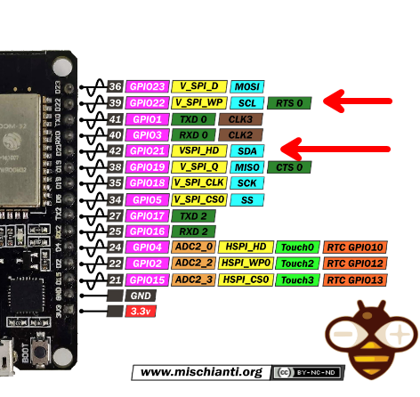

# Lab : การต่อเชื่อมอุปกรณ์ภายนอกผ่าน I2C โดยใช้ ESP32

# สรุปการเขียนส่งรายงานผล


## TOC


- [Lab : การต่อเชื่อมอุปกรณ์ภายนอกผ่าน I2C โดยใช้ ESP32](#lab-การต่อเชื่อมอุปกรณ์ภายนอกผ่าน-i2c-โดยใช้-esp32)
- [จุดประสงค์](#จุดประสงค์)
- [เครื่องมือที่ใช้](#เครื่องมือที่ใช้)
- [Lab 1 - ฝึกใช้ I2C ผ่านการควบคุม I/O Expander](#lab-1-ฝึกใช้-i2c-ผ่านการควบคุม-io-expander)
  - [Lab 1.1 — ใช้ Library สำเร็จรูป](#lab-11-ใช้-library-สำเร็จรูป)
  - [Lab 1.2 — ใช้คำสั่ง I2C โดยตรง](#lab-12-ใช้คำสั่ง-i2c-โดยตรง)
- [Lab 2 - ฝึกใช้ I2C ผ่านโมดูลนาฬิกาและหน้าจอแสดงผล](#lab-2-ฝึกใช้-i2c-ผ่านโมดูลนาฬิกาและหน้าจอแสดงผล)
  - [Lab 2.1 — ใช้ Library สำเร็จรูป](#lab-21-ใช้-library-สำเร็จรูป)
  - [Lab 2.2 — ใช้คำสั่ง i2c โดยตรง (เฉพาะนาฬิกา)](#lab-22-ใช้คำสั่ง-i2c-โดยตรง-เฉพาะนาฬิกา)
- [Lab 3 — Reverse Engineer โมดูล LCD Display เพื่อควบคุมบางความสามารถผ่าน i2c โดยตรง](#lab-3-reverse-engineer-โมดูล-lcd-display-เพื่อควบคุมบางความสามารถผ่าน-i2c-โดยตรง)
  - [โจทย์](#โจทย์)

## จุดประสงค์

  1. ผู้เรียนได้ศึกษาการเชื่อมต่ออุปกรณ์ I2C ในวงจร
  2. ผู้เรียนได้เขียนโปรแกรมใช้งานอุปกรณ์ I2C ทั้งโดยใช้ Library สำเร็จรูป และใช้คำสั่ง i2c โดยตรง
  3. ผู้เรียนได้ศึกษาคุณสมบัติและการทำงานของ I2C


## เครื่องมือที่ใช้

  1. ESP32 — ไมโครคอนโทรลเลอร์
  2. I2C I/O Expander — PCF8574 (Address = 0x20) ชิบขยายจำนวน I/O ขนาด 8 ช่อง  
[[Datasheet](https://www.nxp.com/docs/en/data-sheet/PCF8574_PCF8574A.pdf)]

  3. Clock Module — DS1307 Realtime Clock (Address = 0x68) ใช้ดึงค่าวันเวลาปัจจุบัน  
[[Datasheet](https://www.sparkfun.com/datasheets/Components/DS1307.pdf)]

  4. LCD 16x2 Display (Address = 0x27) — ใช้แสดงผล  
[[Datasheet](http://www.handsontec.com/dataspecs/module/I2C_1602_LCD.pdf)]

  5. ตัวต้านทาน pull-up 3.3K สองตัวใช้กับขา SCL, SDA

* * *

## Lab 1 - ฝึกใช้ I2C ผ่านการควบคุม I/O Expander

### Lab 1.1 — ใช้ Library สำเร็จรูป


> PCF8574 Pinout


> Schematic การต่อ PCF8574 เข้ากับ ESP32 — ปุ่มกับ LED จะเลือกต่อพอร์ด P0-P7 ใด ๆ ก็ได้ แต่ต้องเขียนโปรแกรมให้สอดคล้องกัน

#### โจทย์

ให้ต่อปุ่มกด และ LED เข้ากับ PCF8574 แล้วเขียนโปรแกรมเพื่อควบคุมให้ LED
ติดดับตามสถานะการกดปุ่ม (กดติด-ปล่อยดับ)

#### ให้ทำตามขั้นต่อต่อไปนี้



> แสดงตำแหน่งขา SCL, SDA บน ESP32 (ขา GPIO21, 22)

  1. ต่อ PCF8574 เข้ากับ ESP32 ผ่าน I2C โดยดูขาที่ต้องใช้จาก Pinout ของอุปกรณ์ ซึ่งต้องใช้สาย 4 เส้น คือ

  * SCL/SDA — ใช้รับส่งข้อมูล I2C
  * Vcc — ต่อไป 3.3V (PCF8574 รองรับไฟทั้ง 3.3 และ 5V แต่ในที่นี้เราจะใช้ 3.3 ให้ตรงกับแรงดันของ MCU)
  * Gnd — Ground

2. ลองต่อ LED เข้ากับ I/O ตัวใดตัวหนึ่ง โดยใช้ PCF8574 ขับแบบ Low-side
คือต่อไฟเข้า LED แล้วลง Ground ผ่าน PCF8574 เนื่องจาก PCF8574
จ่ายกระแสได้ค่อนข้างจำกัด

3. เขียนโปรแกรมควบคุม

  * ติดตั้ง Library ชื่อ Adafruit PCF8574 (เลือก Manage Library จากเมนู Tools แล้วค้นหา)
  * จากคู่มือของ Library เราสามารถลองเขียนโปรแกรมเปิดปิด LED ได้ดังนี้ — ขอให้แก้ Pin ที่ใช้ให้ตรงกับที่ต่อไว้ในวงจร

```c


#include <Adafruit_PCF8574.h>  
/* Example for 1 output LED that is connected from power to the GPIO expander pin #7  
 * Note the LEDs must be connected with the CATHODES to the expander, to SINK current!  
 * The PCF8574 cannot SOURCE current!  
 */  
  
#define PCF8574_Address 0x20  
  
Adafruit_PCF8574 pcf;  
void setup() {  
  Serial.begin(9600);  
  Serial.println("Adafruit PCF8574 LED blink test");  
  if (!pcf.begin(PCF8574_Address, &Wire)) {  
    Serial.println("Couldn't find PCF8574");  
  }  
  pcf.pinMode(7, OUTPUT);  
}  
void loop() {  
  pcf.digitalWrite(7, LOW);  // turn LED on by sinking current to ground  
  delay(1000);  
  pcf.digitalWrite(7, HIGH); // turn LED off by turning off sinking transistor  
  delay(1000);  
}
```

4. ลองปรับปรุงโปรแกรมเพื่อทำโจทย์ กดปุ่มคุม LED ที่กำหนดให้สำเร็จ  
คำสั่งที่ใช้ในการอ่านค่าปุ่ม มีดังนี้คือ

  * pcf.pinMode(0, INPUT); // กำหนดให้ Pin P0 ทำหน้าที่เป็น Input
  * pcf.digitalRead(0); //อ่านค่าสถานะของ P0

* * *

### Lab 1.2 — ใช้คำสั่ง I2C โดยตรง

ปฏิบัติการที่แล้วเป็นการทดสอบวงจรโดยใช้ Library สำเร็จรูป
ซึ่งทำให้การใช้งานวงจรไม่จำเป็นต้องมีความรู้เรื่อง I2C เลย
ในปฏิบัติการนี้จะลองควบคุม PCF8574 ผ่าน I2C โดยตรง

#### โจทย์

ให้ต่อปุ่มกด และ LED เข้ากับ PCF8574 แล้วเขียนโปรแกรมเพื่อควบคุมให้ LED
ติดดับตามสถานะการกดปุ่ม (กดติด-ปล่อยดับ)

#### ให้ลองตามขั้นตอนต่อไปนี้

  1. **ลอง I2C Library โดยการ detect I2C device**

เราจะใช้ I2C Library ของ Adafruit ชื่อ Adafruit BusIO
ซึ่งจะถูกติดตั้งมาพร้อมกับ Library PCB8574 ในปฏิบัติการก่อนหน้าแล้ว
ไม่ต้องติดตั้งเพิ่มเติม

โปรแกรมต่อไปนี้เป็นตัวอย่างตรวจสอบว่าพบอุปกรณ์ I2C ในวงจรหรือไม่

```c


#include <Adafruit_I2CDevice.h>  
  
#define PCF8574_Address 0x20  
  
Adafruit_I2CDevice i2c_dev = Adafruit_I2CDevice(PCF8574_Address);  
  
void setup() {  
  
  Serial.begin(9600);  
  Serial.println("I2C address detection test");  
  if (!i2c_dev.begin()) {  
    Serial.print("Did not find device at 0x");  
    Serial.println(i2c_dev.address(), HEX);  
    while (1);  
  }  
  Serial.print("Device found on address 0x");  
  Serial.println(i2c_dev.address(), HEX);  
}  
void loop() {  
    
} 
```

2. **ลองควบคุม PCF8574**

โปรแกรมต่อไปนี้จะเปิด-ปิด LED ทุก ๆ 1 วินาที

```c


#include <Adafruit_I2CDevice.h>

#define PCF8574_Address 0x20

Adafruit_I2CDevice i2c_dev = Adafruit_I2CDevice(PCF8574_Address);
uint8_t buffer[32];
uint8_t bitConfig = 0b00000000; // P0–P7 config bits

void setup() {

  Serial.begin(9600);
  Serial.println("I2C address detection test");

  if (!i2c_dev.begin()) {
    Serial.print("Did not find device at 0x");
    Serial.println(i2c_dev.address(), HEX);
    while (1);
  }

  Serial.print("Device found on address 0x");
  Serial.println(i2c_dev.address(), HEX);
}

void loop() {

  // set bit 7 to high impedance (logic high)
  bitSet(bitConfig, 7);
  buffer[0] = bitConfig;
  i2c_dev.write(buffer, 1);   // turn off LED
  delay(1000);

  // set bit 7 to drain (logic low)
  bitClear(bitConfig, 7);
  buffer[0] = bitConfig;
  i2c_dev.write(buffer, 1);   // turn on LED
  delay(1000);
}

```

#### อธิบายการควบคุม PCF8574 ผ่าน I2C

**A. การกำหนดสถานะของ I/O** — สถานะของ I/O ทั้ง 8 ช่อง (P0-P7)
มีให้เลือกสองค่า คือ

  * **High Impedance (Input)** — ถ้าเราเขียนค่า 1 ไปที่บิตของ I/O ใด ชิปจะต่อ Internal pull-up เข้ากับขานั้น   
ดั้งนั้นสามารถใช้ขานี้ใช้เป็น input ได้ หรือถ้าใช้เป็น Output ก็ต้องมีวงจร
driver เพื่อขยายกำลังขับ (เพราะกระแสที่ส่งออกมานั้นน้อยมาก แค่ 0.3 mA)

  * **Drain (output)** — ถ้าเราเขียนค่า 0 ไปที่บิตของ I/O ใด ชิปจะต่อขา I/O นั้น ๆ ลง Ground ซึ่งสามารถ sink กระแสได้สูงสุด 25 mA ซึ่งพอสำหรับโหลดขนาดเล็ก เช่น LED แต่ถ้าจะขับโหลดที่กระแสสูงกว่านั้นเช่นมอเตอร์ ก็ต้องต่อผ่านวงจรขับอีกทอดหนึ่ง

**B. การเขียนค่าไปยัง PCF8574** — ทำโดยการส่งค่า data byte (8 bit)
โดยใช้คำสั่ง

`i2c_dev.write(*buffer, length);`

โดย Buffer คือ pointer ไปยัง array ที่ใช้เก็บค่าเพื่อการรับ-ส่งระหว่างอุปกรณ์
และ length คือความยาวของข้อมูลที่จะส่ง

```c


uint8_t buffer[32];  
buffer[0]=0b10000000;   // set bit 7 to high  
i2c_dev.write(buffer,1);  // turn off LED
```

ตัวอย่างข้างต้นจะส่งค่า 0b10000000 ไปยัง PCF8574

**C. การอ่านค่า input จาก PCF8574**

การใช้ I/O ของ PCF8574 เป็น input มีสองขั้นตอนคือ

a) ตั้งบิตของ I/O ที่จะใช้เป็น Input ให้เป็น 1 (High impedance)

b) อ่านค่า

ดูตัวอย่างโปรแกรมต่อไปนี้

```c


uint8_t buffer[32];
uint8_t bitConfig;
uint8_t P0_state;

// set bit 0 to 1 (high impedance)
bitSet(bitConfig, 0);
buffer[0] = bitConfig;
i2c_dev.write(buffer, 1);

while (1) {
  delay(100);   // optional delay

  // read the pin state from PCF8574
  i2c_dev.read(buffer, 1);

  // read the state of P0
  P0_state = bitRead(buffer[0], 0);

  Serial.println(P0_state);
}

```

สามารถอ่านสถานะของ Port ทั้ง 8 ช่องผ่านทางคำสั่ง i2c_dev.read() ดังนี้

`i2c_dev.read(*buffer, length);`

โดย buffer คือ pointer ไปยัง array ที่ใช้เก็บค่าที่อ่านมา และ length
คือความยาว (bytes) ที่ต้องการอ่าน

D. **ใช้ Logic Analyzer อ่านข้อมูลที่รับส่งใน I2C Bus** — ใช้ Protocol
Analyzer ของ Logic Analyzer เพื่อเทียบดูว่าส่งที่เห็นใน Logic Analyzer
ตรงกับค่าในโปรแกรมหรือไม่

* * *

## Lab 2 - ฝึกใช้ I2C ผ่านโมดูลนาฬิกาและหน้าจอแสดงผล

### Lab 2.1 — ใช้ Library สำเร็จรูป

ปฏิบัติการนี้จะเพิ่มอุปกรณ์ลงไปใน I2C Bus อีก 2 ชิ้น คือ realtime clock และ
display

#### โจทย์

เขียนโปรแกรมเพื่ออ่านค่าวันและเวลา แสดงบนหน้าจอ LCD ดังตัวอย่าง


> แสดงนาฬิกาที่เสร็จสมบูรณ์แล้ว


> โมดูลนาฬิกา

#### ให้ทำตามขั้นตอนต่อไปนี้

  1. ศึกษาการเชื่อมต่อวงจร และโปรแกรมตัวอย่างจาก Simulator ต่อไปนี้  
<https://wokwi.com/projects/385778756606184449>

  2. ลองต่อวงจรโดยต่ออุปกรณ์สองชิ้นต่อไปนี้

  * DS1307 Realtime clock
  * หน้าจอ LCD 16x2 (I2C) — หน้าจอมีหลายแบบ ขอให้แน่ใจว่าเลือกใช้แบบ I2C

3. เชื่อมอุปกรณ์ทั้งสองเข้ากับ ESP32 ดังนี้

  * พ่วงขา SCL, SDA
  * ต่อ ไฟ และ ดิน ให้ทุกอุปกรณ์ — แนะนำให้จ่ายไฟ 5V กับหน้าจอ เพราะจะช่วยให้ backlight สว่างอ่านได้ง่าย


> Schematic การต่อ DS1307 และ LCD Display เข้ากับ ESP32 ผ่าน I2C

4. ลองเขียนโปรแกรม โดยสามารถดูตัวอย่างโปรแกรมต่อไปนี้เป็นต้นแบบ

**DS1307 (Address = 0x68)** — ใช้ Arduino Library
สำเร็จรูปสามารถอ่านค่าวันเวลาออกมาได้โดยง่าย

  * ติดตั้ง Library โดยค้นหาชื่อ “RTClib Adafruit”
  * [ตัวอย่างโปรแกรม](https://github.com/adafruit/RTClib/blob/master/examples/ds1307/ds1307.ino)

**LCD Display (Address = 0x27)** — ใช้ Arduino Library สำเร็จรูปเช่นเดียวกัน
สามารถสั่งงานได้โดยง่าย

  * ติดตั้ง Library โดยค้นหา “LCD_I2C blackhack”
  * [ตัวอย่างโปรแกรม](https://github.com/blackhack/LCD_I2C/blob/master/examples/Hello_World/Hello_World.ino)

ให้ดัดแปลงโปรแกรมจาก Library ข้างต้นเพื่อให้ได้ผลตามที่ต้องการ

* * *

### Lab 2.2 ใช้คำสั่ง i2c โดยตรง (เฉพาะนาฬิกา)

โปรแกรมที่ใช้ในปฏิบัติการก่อนหน้าเป็น library สำเร็จรูป ซึ่งใช้งานง่ายก็จริง
แต่ไม่ได้ช่วยให้เข้าใจถึงหลักการสื่อสารตาม protocol i2c
ดังนั้นขอให้ลองเขียนโปรแกรมเดิมใหม่อีกครั้ง โดยเปลี่ยนส่วนที่อ่านค่าวันเวลาจาก
DS1307 ให้ใช้คำสั่ง i2c โดยตรง

#### โจทย์

ให้ปรับโปรแกรมเพื่ออ่านค่าจาก DS1307 โดยใช้คำสั่ง I2C โดยตรง ไม่ใช้ Library


> I2C Library

ในปฏิบัติการนี้เราจะใช้ I2C library ชื่อ Adafruit BusIO
เช่นเดียวกับปฏิบัติการก่อนหน้า

ขอให้ศึกษาการใช้งานได้จาก[ example ของ Library บน
github](https://github.com/adafruit/Adafruit_BusIO/tree/master/examples)
ต่อไปนี้

[**Adafruit_BusIO/examples at master · adafruit/Adafruit_BusIO**  
 _I2C, SPI and UART abstractions for use with Arduino —
Adafruit_BusIO/examples at master · adafruit/Adafruit_BusIO_
github.com](https://github.com/adafruit/Adafruit_BusIO/tree/master/examples
"https://github.com/adafruit/Adafruit_BusIO/tree/master/examples")[](https://github.com/adafruit/Adafruit_BusIO/tree/master/examples)

[นอกจากนั้นยังสามารถอ้างอิง reference ของ library
ได้ที่นี](https://adafruit.github.io/Adafruit_BusIO/html/class_adafruit___i2_c_device.html)

ให้ทดลองดังนี้

  1. Device Detect- ดูว่าพบอุปกรณ์ I2C ตาม Address ที่กำหนดหรือไม่ ตามวิธีการที่ได้ทดลองไปแล้วในปฏิบัติการก่อนหน้า เพื่อตรวจให้แน่ใจว่ามองเห็นอุปกรณ์   
\- Address ของ DS1307 คือ 0x68

2. อ่านข้อมูลจาก Register ของ DS1307

ให้ใช้คำสั่ง write_then_read() โดยเริ่มอ่านตั้งแต่ register 0 ถึง register 7
(รวม 8 byte) โดยศึกษาวิธีใช้งานจาก[ตัวอย่างของ Library ชื่อ
“i2c_readwrite”](https://github.com/adafruit/Adafruit_BusIO/blob/master/examples/i2c_readwrite/i2c_readwrite.ino)

เมื่ออ่านมาแล้วให้อ่านค่าออกมาจาก Buffer แล้วลองแสดงค่าบน LCD
และสำรวจว่าค่าถูกต้องหรือไม่

#### การแปลง BCD -> Decimal เพื่อใช้งานค่าวันเวลาใน Register

เนื่องจากค่าที่ได้จาก DS1307 ถูกเก็บในรูปแบบที่เรียกว่า BCD (Binary-Coded Decimal) ซึ่งจะต้องถูกแปลงเป็นตัวเลขธรรมดาก่อนถึงจะนำไปใช้งานได้

BCD format จะเก็บเลขหลักหน่วยในบิต 0-3 และเลขหลักสิบในบิต 4-7 เช่น ถ้าค่าวินาทีมีค่า BCD = 0b0010 0001 ค่าตัวเลข Decimal ธรรมดาคือ 21  (0b0010, 0b0001)

Function ต่อไปนี้ช่วยแปลง BCD -> Decimal

```c

static uint8_t bcdToDec(uint8_t bcd) {
  return (uint8_t)(10 * (bcd >> 4) + (bcd & 0x0F));
}

```

ค่าที่มีความซับซ้อนคือค่า Hour เพราะนอกจากเก็บเป็น BCD แล้ว ยังมี bit ที่ใช้กำหนดโหมด 24 Hr กับ AM/PM ด้วย ดังนี้

- Bit 6: 1 = AM/PM ,  0 = 24 Hrs
- Bit 5: 1 = PM, 0 = AM สำหรับโหมด AM/PM ,  ถ้าใช้โหมด 24 Hrs บิตนี้ใช้เป็นค่า BCD หลักสิบร่วมกับิต 4


* * *

## Lab 3 — Reverse Engineer โมดูล LCD Display เพื่อควบคุมบางความสามารถผ่าน i2c โดยตรง

โมดูล LCD แบบ I2C ที่ใช้ในวงจรแท้จริงแล้วมีโมดูลย่อยสองตัวคือ

  * LCD Display — ควบคุมผ่านขาสัญญาณแบบ Parallel 8 เส้น
  * I2C IO extension- เป็นโมดูลที่ควบคุม IO ผ่าน I2C

โดยคำสั่งที่งส่งผ่าน I2C ไปยัง โมดูลนี้มีความซับซ้อนกว่า DS1307 มาก
การศึกษาจะใช้เวลาพอสมควร
ดังนั้นปฏิบัติการนี้จะให้ควบคุมเพียงบางความสามารถเท่านั้น

### โจทย์

ให้ Reverse Engineer โดยใช้ Logic Analyzer เพื่อแกะโปรโตคอลของ Library
และลองควบคุมความสามารถ 2 อย่างต่อไปนี้

  * การแสดง Cursor — โดยปกติหน้าจอจะไม่แสดง cursor ดังนั้นเราจะทดลองเปิดดู
  * การกระพริบ Cursor — หากเปิดใช้จะทำให้ cursor กะพริบ


> ภาพแสดง cursor ที่กะพริบอยู่ (ท้ายคำว่า Hello, world!)

ให้ทำตามขั้นตอนต่อไปนี้

  1. ลองสั่งเปิดและกระพริบ cursor โดยใช้ library สำเร็จรูปและใช้ Logic Analyzer บันทึก Pulse ไว้

คำสั่งที่ใช้ (ไม่รวมส่วนตั้งค่าเริ่มต้น) ได้แก่

  * lcd.cursor(), lcd.nocursor() — แสดงและซ่อน cursor ตามลำดับ
  * lcd.blink(), lcd.noblink() — กระพริบและไม่กระพริบ cursor ตามลำดับ

โดยดูตัวอย่างโปรแกรมจาก [example ของ
Library](https://github.com/blackhack/LCD_I2C/blob/master/examples/Functions/Functions.ino)

2. เมื่อบันทึก pulse แล้ว ให้เปิดดูใน Logic Analyzer
และลองพยายามส่งสัญญาณเลียนแบบโดยใช้คำสั่ง I2C

```c


i2c_dev.write()
```

หากสามารถสั่งงานให้แสดงและกระพริบ cursor ได้ ก็ถือว่าทำปฏบัติการสำเร็จ

