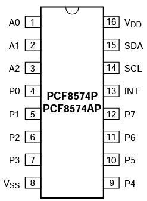
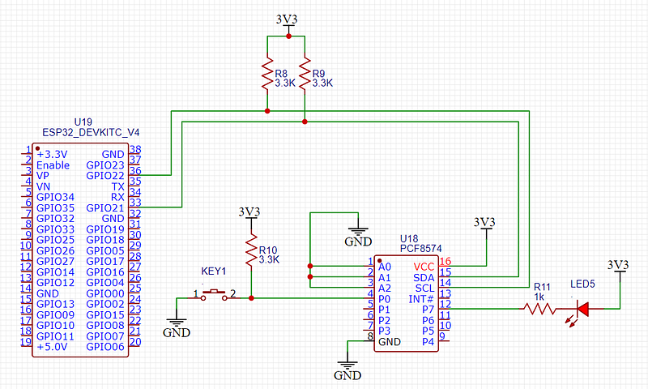
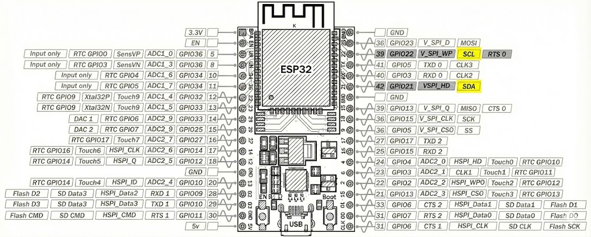
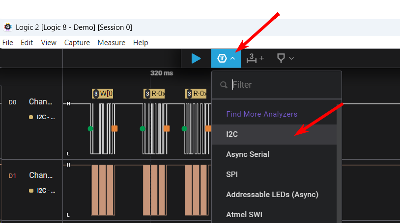
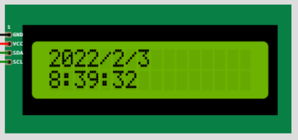
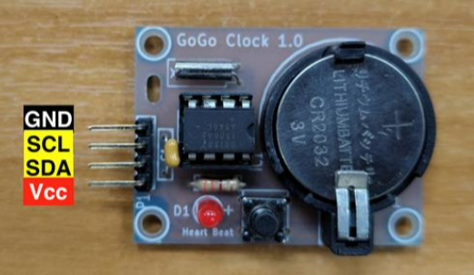
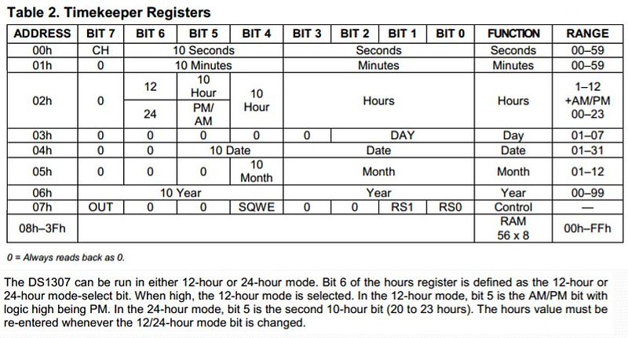

# Lab : การต่อเชื่อมอุปกรณ์ภายนอกผ่าน I2C โดยใช้ ESP32

# สรุปการเขียนส่งรายงานผล

Lab 1 & 2
- อธิบายการทดลอง พร้อมภาพถ่าย
- แสดง pulse และข้อมูลจาก Logic Analyzer อภิปราย และเปรียบเทียบ ดังระบุใน Lab 1.3, 2.3 ตามลำดับ
- อภิปรายถึงความรู้ที่ได้รับจากปฏิบัติการนี้

Lab 3 (ถ้าทำ)
- แสดง Pulse และข้อมูลที่แกะได้จาก Logic Analyzer ที่แสดงให้เห็นถึงคำสั่งที่ใช้กระพริบ cursor
- อภิปรายถึงความรู้ที่ได้รับจากปฏิบัติการนี้


<a id="summary"></a>

## TOC

- [สรุปการเขียนส่งรายงานผล](#summary)
- [จุดประสงค์](#objectives)
- [เครื่องมือที่ใช้](#tools)
- [Lab 1 - ฝึกใช้ I2C ผ่านการควบคุม I/O Expander](#lab-1)
  - [Lab 1.1 — ใช้ Library สำเร็จรูป](#lab-11)
  - [Lab 1.2 — ใช้คำสั่ง I2C โดยตรง](#lab-12)
  - [Lab 1.3 — วิเคราะห์ด้วย Logic Analyzer](#lab-13)
- [Lab 2 - ฝึกใช้ I2C ผ่านโมดูลนาฬิกาและหน้าจอแสดงผล](#lab-2)
  - [Lab 2.1 — ใช้ Library สำเร็จรูป](#lab-21)
  - [Lab 2.2 — อ่าน DS1307 โดยตรงผ่าน I2C](#lab-22)
  - [Lab 2.3 — วิเคราะห์ด้วย Logic Analyzer (เปรียบเทียบ)](#lab-23)
- [Lab 3 — Reverse Engineer โมดูล LCD Display (optional)](#lab-3)
  - [โจทย์ / ขั้นตอนการทดสอบ](#lab-3-steps)
- [References / Datasheets](#tools)

## จุดประสงค์

  1. ผู้เรียนได้ศึกษาการเชื่อมต่ออุปกรณ์ I2C ในวงจร
  2. ผู้เรียนได้เขียนโปรแกรมใช้งานอุปกรณ์ I2C  ทั้งโดยใช้ Library สำเร็จรูป และใช้คำสั่ง i2c โดยตรง
  3. ผู้เรียนได้ศึกษาคุณสมบัติและการทำงานของ I2C 


<a id="tools"></a>
## เครื่องมือที่ใช้

  1. ESP32 — ไมโครคอนโทรลเลอร์
  2. I2C I/O Expander — PCF8574 (Address = 0x20) ชิปขยายจำนวน I/O ขนาด 8 ช่อง  [[Datasheet](https://www.nxp.com/docs/en/data-sheet/PCF8574_PCF8574A.pdf)]

  3. Clock Module — DS1307 Realtime Clock (Address = 0x68) ใช้ดึงค่าวันเวลาปัจจุบัน  [[Datasheet](https://www.sparkfun.com/datasheets/Components/DS1307.pdf)]

  4. LCD 16x2 Display (Address = 0x27) — ใช้แสดงผล  [[Datasheet](http://www.handsontec.com/dataspecs/module/I2C_1602_LCD.pdf)]

  5. ตัวต้านทาน pull-up 3.3K สองตัวใช้กับขา SCL, SDA

* * *

<a id="lab-1"></a>
## Lab 1 - ฝึกใช้ I2C ผ่านการควบคุม I/O Expander

#### โจทย์
```
สาธิตให้เห็นว่าสามารถใช้งาน PCF8574 I/O Expander ได้ โดย
- ต่อปุ่ม และ LED เข้ากับ PCF8574
- เขียนโปรแกรมให้ LED ติดเมื่อกดปุ่ม (กดติด-ปล่อยดับ)

```
ภาพประกอบ



> PCF8574 Pinout



> Schematic การต่อ PCF8574 เข้ากับ ESP32 — ปุ่มกับ LED จะเลือกต่อพอร์ด P0-P7 ใด ๆ ก็ได้ แต่ต้องเขียนโปรแกรมให้สอดคล้องกัน




> แสดงตำแหน่งขา SCL (GPIO22) และ SDA (GPIO21) บน ESP32 DevKitC V3 Rev C — โปรดตรวจสอบกับตัวบอร์ดจริง (silkscreen)

### Lab 1.1 — ใช้ Library สำเร็จรูป

#### ให้ทำตามขั้นต่อต่อไปนี้

  1. ต่อ PCF8574 เข้ากับ ESP32 ผ่าน I2C โดยดูขาที่ต้องใช้จาก Pinout ของอุปกรณ์ ซึ่งต้องใช้สาย 4 เส้น คือ

      * SCL/SDA — ใช้รับส่งข้อมูล I2C
      * Vcc — ต่อไป 3.3V (PCF8574 รองรับไฟทั้ง 3.3 และ 5V แต่ในที่นี้เราจะใช้ 3.3 ให้ตรงกับแรงดันของ MCU)
      * Gnd — Ground

2. ลองต่อ LED เข้ากับ I/O ตัวใดตัวหนึ่ง โดยใช้ PCF8574 ขับแบบ Low-side
คือต่อไฟเข้า LED แล้วลง Ground ผ่าน PCF8574 เนื่องจาก PCF8574
จ่ายกระแสได้ค่อนข้างจำกัด

3. เขียนโปรแกรมควบคุม

      * ติดตั้ง Library ชื่อ Adafruit PCF8574 (เลือก Manage Library จากเมนู Tools แล้วค้นหา)
      * จากคู่มือของ Library เราสามารถลองเขียนโปรแกรมเปิดปิด LED ได้ดังนี้ — ขอให้แก้ Pin ที่ใช้ให้ตรงกับที่ต่อไว้ในวงจร
      * ปรับโปแรกมให้ทำงานให้สำเร็จตามโจทย์

```c
// ตัวอย่างการใช้งาน Adafruit_PCF8574 (LED ต่อแบบ sink current)
#include <Adafruit_PCF8574.h>

#define PCF8574_Address 0x20
Adafruit_PCF8574 pcf;

void setup() {
  Serial.begin(9600);
  Serial.println("Adafruit PCF8574 LED blink test");
  if (!pcf.begin(PCF8574_Address, &Wire)) {
    Serial.println("Couldn't find PCF8574");
    while(1);
  }
  pcf.pinMode(7, OUTPUT);  // ปรับ pin ตามการต่อจริง
  
}

void loop() {
  
  pcf.digitalWrite(7, HIGH);
  delay_ms(1000);
  pcf.digitalWrite(7, LOW);
  delay_ms(1000);
}
```

<!-- insert anchor for Lab 1.1 -->
<a id="lab-11"></a>
### Lab 1.1 — ใช้ Library สำเร็จรูป

#### ให้ทำตามขั้นต่อต่อไปนี้

  1. ต่อ PCF8574 เข้ากับ ESP32 ผ่าน I2C โดยดูขาที่ต้องใช้จาก Pinout ของอุปกรณ์ ซึ่งต้องใช้สาย 4 เส้น คือ

      * SCL/SDA — ใช้รับส่งข้อมูล I2C
      * Vcc — ต่อไป 3.3V (PCF8574 รองรับไฟทั้ง 3.3 และ 5V แต่ในที่นี้เราจะใช้ 3.3 ให้ตรงกับแรงดันของ MCU)
      * Gnd — Ground

2. ลองต่อ LED เข้ากับ I/O ตัวใดตัวหนึ่ง โดยใช้ PCF8574 ขับแบบ Low-side
คือต่อไฟเข้า LED แล้วลง Ground ผ่าน PCF8574 เนื่องจาก PCF8574
จ่ายกระแสได้ค่อนข้างจำกัด

3. เขียนโปรแกรมควบคุม

      * ติดตั้ง Library ชื่อ Adafruit PCF8574 (เลือก Manage Library จากเมนู Tools แล้วค้นหา)
      * จากคู่มือของ Library เราสามารถลองเขียนโปรแกรมเปิดปิด LED ได้ดังนี้ — ขอให้แก้ Pin ที่ใช้ให้ตรงกับที่ต่อไว้ในวงจร
      * ปรับโปแรกมให้ทำงานให้สำเร็จตามโจทย์

```c
// ตัวอย่างการใช้งาน Adafruit_PCF8574 (LED ต่อแบบ sink current)
#include <Adafruit_PCF8574.h>

#define PCF8574_Address 0x20
Adafruit_PCF8574 pcf;

void setup() {
  Serial.begin(9600);
  Serial.println("Adafruit PCF8574 LED blink test");
  if (!pcf.begin(PCF8574_Address, &Wire)) {
    Serial.println("Couldn't find PCF8574");
    while(1);
  }
  pcf.pinMode(7, OUTPUT);  // ปรับ pin ตามการต่อจริง
  
}

void loop() {
  
  pcf.digitalWrite(7, HIGH);
  delay_ms(1000);
  pcf.digitalWrite(7, LOW);
  delay_ms(1000);
}
```

<!-- insert anchor for Lab 1.2 -->
<a id="lab-12"></a>
### 1.2 ใช้คำสั่ง I2C โดยตรง

ให้ทำโจทย์เดิม แต่เปลี่ยนไปใช้คำสั่ง I2C โดยตรง

ขั้นตอน

1. ตรวจหา PCF8574 บน I2C bus หากไม่พบให้แจ้ง error  
2. ควบคุมสถานะ Pin ทั้ง 8 ของ PCF8574

#### 1. การตรวจหา (Ping) PCF8574

ศึกษาตัวอย่างต่อไปนี้

```c
#include <Adafruit_I2CDevice.h>
#define PCF8574_Address 0x20
Adafruit_I2CDevice i2c_dev = Adafruit_I2CDevice(PCF8574_Address);

void setup() {
  Serial.begin(9600);
  Serial.println("I2C address detection test");
  if (!i2c_dev.begin()) {
    Serial.print("device not found at address 0x");
    Serial.println(i2c_dev.address(), HEX);
    while (1);
  }
  Serial.print("device found at address 0x");
  Serial.println(i2c_dev.address(), HEX);
}
```

#### 2. ลองควบคุมสถานะ Pin ทั้ง 8 ของ PCF8574

หลักการควบคุม PCF8574 ผ่าน I2C

**A. การกำหนดสถานะของ I/O** — สถานะของ I/O ทั้ง 8 ช่อง (P0–P7) มีสองค่า:
- **1 (High‑impedance / Input)** — จะต่อ internal pull‑up; ดังนั้นสามารถใช้เป็นขา input ได้  
- **0 (Drain / Output)** — จะต่อขาไปยัง GND เพื่อ sink กระแส (สูงสุด ~25 mA)

**B. การเขียนค่าไปยัง PCF8574** — ทำโดยการส่งค่า data byte (8 bit) โดยใช้คำสั่ง

`i2c_dev.write(*buffer, length);`

โดย Buffer คือ pointer ไปยัง array ที่ใช้เก็บค่าเพื่อการรับ-ส่งระหว่างอุปกรณ์
และ length คือความยาวของข้อมูลที่จะส่ง

```c
uint8_t buffer[32];  
buffer[0]=0b10000000;   // set bit 7 to high  
i2c_dev.write(buffer,1);  // turn off LED
```

ตัวอย่างข้างต้นจะส่งค่า 0b10000000 ไปยัง PCF8574

**C. การอ่านค่า input จาก PCF8574** — ตัวอย่างการตั้งบิตและอ่านสถานะ
```c
uint8_t buffer[32];
uint8_t bitConfig = 0;
uint8_t P0_state;

// set bit 0 to 1 (high impedance -> input)
bitSet(bitConfig, 0);
buffer[0] = bitConfig;
i2c_dev.write(buffer, 1);

while (1) {
  delay(100);
  i2c_dev.read(buffer, 1);
  P0_state = bitRead(buffer[0], 0);
  Serial.println(P0_state);
}
```

### Lab 1.3 ใช้ Logic Analyzer อ่านข้อมูลที่รับส่งใน I2C Bus

ใช้ Protocol Analyzer ของ Logic Analyzer เพื่อเทียบดูว่าสัญญาณที่บันทึกได้ตรงกับสิ่งที่โปรแกรมส่ง/รับหรือไม่

ขั้นตอน
- ต่อ Logic Analyzer กับ SCL, SDA  
- เปิด I2C protocol analyzer บันทึกการสื่อสารขณะที่เรียกใช้ทั้งแบบไลบรารีและแบบเขียน I2C ตรง  
- เปรียบเทียบ waveform และข้อมูลที่รับ/ส่งเพื่อยืนยันพฤติกรรม
  - เห็น Address ของ PCF8574 หรือไม่
  - เห็นค่าที่รับ และส่งจาก PCF8574 เพื่ออ่านสถานะปุ่ม และเพื่อควบคุม LED หรือไม่
  - ลำดับของข้อมูลที่เห็นใน bus ตรงตามหลักการหรือไม่ อย่างไร

  
  > รูปแสดงการเปิด I2C protocol analyzer


* * *

<a id="lab-2"></a>
## Lab 2 - ฝึกใช้ I2C ผ่านโมดูลนาฬิกาและหน้าจอแสดงผล

### Lab 2.1 — ใช้ Library สำเร็จรูป

ปฏิบัติการนี้จะเพิ่มอุปกรณ์ลงไปใน I2C Bus อีก 2 ชิ้น คือ realtime clock และ
display

#### โจทย์
```
เขียนโปรแกรมเพื่ออ่านค่าวันและเวลา แสดงบนหน้าจอ LCD ดังตัวอย่าง
```



> แสดงนาฬิกาที่เสร็จสมบูรณ์แล้ว



> โมดูลนาฬิกา 

หมายเหตุ: รุ่นของ RTC Module อาจมีรูปร่างต่างกันไป แต่วิธีการต่อวงจรและเรียกใช้งานจะเหมือนกัน

#### ให้ทำตามขั้นตอนต่อไปนี้

  1. ศึกษาการเชื่อมต่อวงจร และโปรแกรมตัวอย่างจาก Simulator ต่อไปนี้  
<https://wokwi.com/projects/385778756606184449>

  2. ลองต่อวงจรจริง โดยต่ออุปกรณ์สองชิ้นต่อไปนี้

      * DS1307 Realtime clock
      * หน้าจอ LCD 16x2 (I2C) — หน้าจอมีหลายแบบ ขอให้แน่ใจว่าเลือกใช้แบบ I2C

3. เชื่อมอุปกรณ์ทั้งสองเข้ากับ ESP32 ดังนี้

      * พ่วงขา SCL, SDA
      * ต่อ ไฟ และ ดิน ให้ทุกอุปกรณ์ — แนะนำให้จ่ายไฟ 5V กับหน้าจอ เพราะจะช่วยให้ backlight สว่างอ่านได้ง่าย


> Schematic การต่อ DS1307 และ LCD Display เข้ากับ ESP32 ผ่าน I2C

4. ลองเขียนโปรแกรม โดยสามารถดูตัวอย่างโปรแกรมต่อไปนี้เป็นต้นแบบ

**DS1307 (Address = 0x68)** — ใช้ Arduino Library
สำเร็จรูปสามารถอ่านค่าวันเวลาออกมาได้โดยง่าย

  * ติดตั้ง Library โดยค้นหาชื่อ “RTClib Adafruit”
  * [ตัวอย่างโปรแกรม](https://github.com/adafruit/RTClib/blob/master/examples/ds1307/ds1307.ino)

**LCD Display (Address = 0x27)** — ใช้ Arduino Library สำเร็จรูปเช่นเดียวกัน
สามารถสั่งงานได้โดยง่าย

  * ติดตั้ง Library โดยค้นหา “LCD_I2C blackhack”
  * [ตัวอย่างโปรแกรม](https://github.com/blackhack/LCD_I2C/blob/master/examples/Hello_World/Hello_World.ino)

ให้ดัดแปลงโปรแกรมจาก Library ข้างต้นเพื่อให้ได้ผลตามที่ต้องการ

<!-- insert anchor for Lab 2.1 -->
<a id="lab-21"></a>
### Lab 2.1 — ใช้ Library สำเร็จรูป

ปฏิบัติการนี้จะเพิ่มอุปกรณ์ลงไปใน I2C Bus อีก 2 ชิ้น คือ realtime clock และ
display

#### โจทย์
```
เขียนโปรแกรมเพื่ออ่านค่าวันและเวลา แสดงบนหน้าจอ LCD ดังตัวอย่าง
```


> แสดงนาฬิกาที่เสร็จสมบูรณ์แล้ว


> โมดูลนาฬิกา 

หมายเหตุ: รุ่นของ RTC Module อาจมีรูปร่างต่างกันไป แต่วิธีการต่อวงจรและเรียกใช้งานจะเหมือนกัน

#### ให้ทำตามขั้นตอนต่อไปนี้

  1. ศึกษาการเชื่อมต่อวงจร และโปรแกรมตัวอย่างจาก Simulator ต่อไปนี้  
<https://wokwi.com/projects/385778756606184449>

  2. ลองต่อวงจรจริง โดยต่ออุปกรณ์สองชิ้นต่อไปนี้

      * DS1307 Realtime clock
      * หน้าจอ LCD 16x2 (I2C) — หน้าจอมีหลายแบบ ขอให้แน่ใจว่าเลือกใช้แบบ I2C

3. เชื่อมอุปกรณ์ทั้งสองเข้ากับ ESP32 ดังนี้

      * พ่วงขา SCL, SDA
      * ต่อ ไฟ และ ดิน ให้ทุกอุปกรณ์ — แนะนำให้จ่ายไฟ 5V กับหน้าจอ เพราะจะช่วยให้ backlight สว่างอ่านได้ง่าย


> Schematic การต่อ DS1307 และ LCD Display เข้ากับ ESP32 ผ่าน I2C

4. ลองเขียนโปรแกรม โดยสามารถดูตัวอย่างโปรแกรมต่อไปนี้เป็นต้นแบบ

**DS1307 (Address = 0x68)** — ใช้ Arduino Library
สำเร็จรูปสามารถอ่านค่าวันเวลาออกมาได้โดยง่าย

  * ติดตั้ง Library โดยค้นหาชื่อ “RTClib Adafruit”
  * [ตัวอย่างโปรแกรม](https://github.com/adafruit/RTClib/blob/master/examples/ds1307/ds1307.ino)

**LCD Display (Address = 0x27)** — ใช้ Arduino Library สำเร็จรูปเช่นเดียวกัน
สามารถสั่งงานได้โดยง่าย

  * ติดตั้ง Library โดยค้นหา “LCD_I2C blackhack”
  * [ตัวอย่างโปรแกรม](https://github.com/blackhack/LCD_I2C/blob/master/examples/Hello_World/Hello_World.ino)

ให้ดัดแปลงโปรแกรมจาก Library ข้างต้นเพื่อให้ได้ผลตามที่ต้องการ

<!-- lab-22 already exists -->
<a id="lab-22"></a>
### Lab 2.2 ใช้คำสั่ง I2C โดยตรง (เฉพาะนาฬิกา)

โปรแกรมที่ใช้ในปฏิบัติการก่อนหน้าเป็น library สำเร็จรูป ซึ่งใช้งานง่ายก็จริง
แต่ไม่ได้ช่วยให้เข้าใจถึงหลักการสื่อสารตาม protocol i2c
ดังนั้นขอให้ลองเขียนโปรแกรมเดิมใหม่อีกครั้ง โดยเปลี่ยนส่วนที่อ่านค่าวันเวลาจาก
DS1307 ให้ใช้คำสั่ง i2c โดยตรง

#### โจทย์
```
- ให้ปรับโปรแกรมเพื่ออ่านค่าจาก DS1307 โดยใช้คำสั่ง I2C โดยตรง ไม่ใช้ Library
- หน้าจอ LCD ยังใช้ Library สำเร็จเหมือนเดิม เพราะคำสั่ง I2C ค่อนข้างซับซ้อน เกิดขอบเขตของปฏิบัติการนี้
```



> ภาพแสดง Register Map ของ DS1307

#### I2C Library

ในปฏิบัติการนี้เราจะใช้ I2C library ชื่อ Adafruit BusIO
เช่นเดียวกับปฏิบัติการก่อนหน้า

- ขอให้ศึกษาการใช้งานได้จาก example ของ Library บน github ต่อไปนี้

  https://github.com/adafruit/Adafruit_BusIO/tree/master/examples

- นอกจากนั้นยังสามารถอ้างอิง reference ของ library ได้ที่นี 

  https://adafruit.github.io/Adafruit_BusIO/html/class_adafruit___i2_c_device.html

#### ขั้นตอนการทดลอง

  1. Device Detect - ดูว่าพบอุปกรณ์ I2C ตาม Address ที่กำหนดหรือไม่ ตามวิธีการที่ได้ทดลองไปแล้วในปฏิบัติการก่อนหน้า เพื่อตรวจให้แน่ใจว่ามองเห็นอุปกรณ์   
\- Address ของ DS1307 คือ 0x68

2. อ่านข้อมูลจาก Register ของ DS1307

ให้ใช้คำสั่ง write_then_read() โดยเริ่มอ่านตั้งแต่ register 0 ถึง register 7 (รวม 8 byte) โดยศึกษาวิธีใช้งานจากตัวอย่างของ Library ชื่อ “i2c_readwrite”

https://github.com/adafruit/Adafruit_BusIO/blob/master/examples/i2c_readwrite/i2c_readwrite.ino

เมื่ออ่านมาแล้วให้อ่านค่าออกมาจาก Buffer แล้วลองแสดงค่าบน LCD
และสำรวจว่าค่าถูกต้องหรือไม่

* * *

#### การแปลง BCD -> Decimal เพื่อใช้งานค่าวันเวลาใน Register

  - เนื่องจากค่าที่ได้จาก DS1307 ถูกเก็บในรูปแบบที่เรียกว่า BCD (Binary-Coded Decimal) ซึ่งจะต้องถูกแปลงเป็นตัวเลขธรรมดาก่อนถึงจะนำไปใช้งานได้

  - BCD format จะเก็บเลขหลักหน่วยในบิต 0-3 และเลขหลักสิบในบิต 4-7 เช่น ถ้าค่าวินาทีมีค่า BCD = 0b0010 0001 ค่าตัวเลข Decimal ธรรมดาคือ 21  (0b0010, 0b0001)

  ฟังก์ชันแปลง BCD -> Decimal:
  ```c
  static uint8_t bcdToDec(uint8_t bcd) {
    return (uint8_t)(10 * (bcd >> 4) + (bcd & 0x0F));
  }
  ```

  ค่าที่มีความซับซ้อนคือค่า Hour เพราะนอกจากเก็บเป็น BCD แล้ว ยังมี bit ที่ใช้กำหนดโหมด 24 Hr กับ AM/PM ด้วย ดังนี้

  - Bit 6: 1 = AM/PM ,  0 = 24 Hrs
  - Bit 5: 1 = PM, 0 = AM สำหรับโหมด AM/PM ,  ถ้าใช้โหมด 24 Hrs บิตนี้ใช้เป็นค่า BCD หลักสิบร่วมกับิต 4

* * *

<a id="lab-23"></a>
### Lab 2.3 ใช้ Logic Analyzer เปรียบเทียบข้อมูล I2C

ใช้ Logic Analyzer จับสัญญาที่วิ่งใน bus สำหรับ lab 2.1 และ 2.2 
- แสดงและอภิปรายค่าที่ส่งและรับ
- เปรียบเทียบค่าใน bus ระหว่างการใช้ Library สำเร็จรูป กับ การเขียน I2C เอง


* * *

<a id="lab-3"></a>
## Lab 3 (optional) — Reverse Engineer โมดูล LCD Display เพื่อควบคุมบางความสามารถผ่าน I2C โดยตรง

> **Lab นี้ไม่บังคับทำ** 

เป็น Lab ที่ท้าทายขึ้น เพราะต้องแกะคำสั่งจาก Logic Analyzer เพื่อเลียนแบบการสั่งงาน 

### โจทย์

ให้ Reverse Engineer โดยใช้ Logic Analyzer เพื่อแกะโปรโตคอลของ Library
และลองควบคุมความสามารถ 2 อย่างต่อไปนี้

  * การแสดง Cursor — โดยปกติหน้าจอจะไม่แสดง cursor ดังนั้นเราจะทดลองเปิดดู
  * การกระพริบ Cursor — หากเปิดใช้จะทำให้ cursor กะพริบ


> ภาพแสดง cursor ที่กะพริบอยู่ (ท้ายคำว่า Hello, world!)

ให้ทำตามขั้นตอนต่อไปนี้

  1. ลองสั่งเปิดและกระพริบ cursor โดยใช้ library สำเร็จรูปและใช้ Logic Analyzer บันทึก Pulse ไว้

      คำสั่งที่ใช้ (ไม่รวมส่วนตั้งค่าเริ่มต้น) ได้แก่

        * lcd.cursor(), lcd.nocursor() — แสดงและซ่อน cursor ตามลำดับ
        * lcd.blink(), lcd.noblink() — กระพริบและไม่กระพริบ cursor ตามลำดับ

      โดยดูตัวอย่างโปรแกรมจาก [example ของ
      Library](https://github.com/blackhack/LCD_I2C/blob/master/examples/Functions/Functions.ino)

2. เมื่อบันทึก pulse แล้ว ให้เปิดดูใน Logic Analyzer
และลองพยายามส่งสัญญาณเลียนแบบโดยใช้คำสั่ง I2C

```c
i2c_dev.write()
```

หากสามารถสั่งงานให้แสดงและกระพริบ cursor ได้ ก็ถือว่าทำปฏบัติการสำเร็จ

