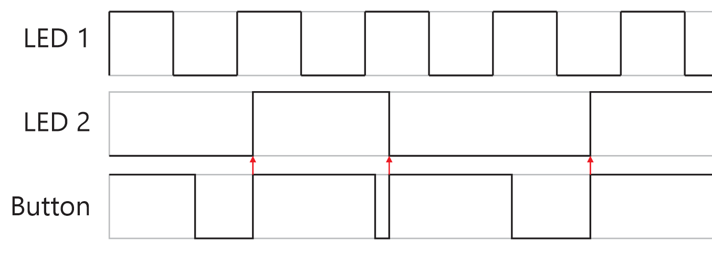
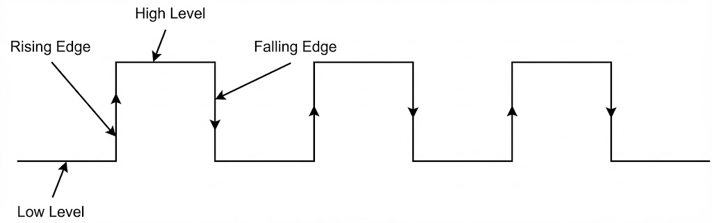

# เรียนรู้ Interrupts โดยใช้ ESP32


## Table of Contents

- [การส่งงาน](#deliverables)
  - [Lab 1 - I/O Interrupt](#lab1-io-interrupt)
  - [Lab 2 - Timer Interrupt](#lab2-timer-interrupt)
- [Lab 1 — ตรวจสอบการกดปุ่ม โดยใช้ I/O Interrupt](#lab1-io-check-button)
  - [โจทย์](#lab1-challenge)
  - [แนวคิดการใช้ Interrupt](#lab1-concept-interrupt)
  - [แนวคิดสำคัญ](#lab1-key-concepts)
    - [ESP32 I/O Interrupt](#esp32-io-interrupt)
    - [Callback (ISR)](#callback-isr-lab1)
  - [คำแนะนำการทำ Lab 1](#lab1-tips)
- [Lab 2 — สร้าง Square Wave ขับลำโพง โดยใช้ Timer Interrupt](#lab2-timer-square-wave)
  - [โจทย์](#lab2-challenge)
  - [วงจร Buzzer](#buzzer-circuit)
  - [แนวทาง](#lab2-approach)
  - [แนวคิดสำคัญ](#lab2-key-concepts)
    - [ตั้งค่า Timer](#timer-setup)
    - [Alarm](#timer-alarm)
    - [Callback (ISR)](#callback-isr-lab2)

---

<a id="deliverables"></a>
## การส่งงาน

<a id="lab1-io-interrupt"></a>
### Lab 1 - I/O Interrupt

- ส่งรูป Pulse การทำงานของ LED1, LED2, สถานะปุ่มกด
- อธิบายว่า pulse นี้พิสูจน์การทำงานที่ถูกต้องตามที่กำหนดอย่างไร
- อธิบายหลักการ I/O Interrupt ที่ได้เรียนรู้

<a id="lab2-timer-interrupt"></a>
### Lab 2 - Timer Interrupt
- ส่งรูป Pulse ของ Square Wave พร้อมใช้ Logic Analyzer วัดค่าความถี่ของ Square Wave นั้น
- รหัสนักศึกษาที่ใช้กำหนดความถี่ 
- อธิบายว่าสร้างความถี่ออกมาผ่าน Timer Interrupt ได้อย่างไร 

---


<a id="lab1-io-check-button"></a>
## Lab 1 — ตรวจสอบการกดปุ่ม โดยใช้ I/O Interrupt

<a id="lab1-challenge"></a>
### โจทย์

**Output ที่ต้องการ**
- LED1 กระพริบทุก ๆ 1 วินาที  
- LED2 กลับสถานะติด/ดับทุกครั้งที่กดปุ่ม (กดติด กดดับ …)

กราฟจาก Logic Analyzer จะมีลักษณะดังตัวอย่างนี้ เมื่อปุ่มกดต่อวงจร pull-up



**วิธีเขียนโปรแกรมที่ให้ลอง**
1. ลองเขียนโดยไม่ใช้ I/O Interrupt — ควรจะพบว่าเขียนโปรแกรมค่อนข้างยาก  
2. ลองเขียนโดยใช้ I/O Interrupt — เพื่อเห็นประโยชน์ว่า Interrupt ช่วยสร้าง Output ที่ต้องการได้อย่างมีประสิทธิภาพ

<a id="lab1-concept-interrupt"></a>
### แนวคิดการใช้ Interrupt

โปรแกรมตัวอย่างต่อไปนี้ จะสลับสถานะติด/ดับของ LED ทุกครั้งที่กดปุ่ม

```c
#define Button_Pin   35
#define LED1_Pin     23

void IRAM_ATTR IO_INT_ISR()
{
  // Toggle The LED
  digitalWrite(LED1_Pin, !digitalRead(LED1_Pin));
}

void setup()
{
  pinMode(LED1_Pin, OUTPUT);
  pinMode(Button_Pin, INPUT);
  attachInterrupt(Button_Pin, IO_INT_ISR, RISING); // interrupt on rising edge
}

void loop()
{
  // Do Nothing...
}
```

<a id="lab1-key-concepts"></a>
### แนวคิดสำคัญ

<a id="esp32-io-interrupt"></a>
#### 1) ESP32 I/O Interrupt

GPIO ของ ESP32 สามารถตั้งค่าให้สร้าง Interrupt ได้ 5 สถานการณ์




- **RISING** — An interrupt is fired on each Rising Edge  
- **FALLING** — An interrupt is fired on each Falling Edge  
- **HIGH** — An interrupt is fired whenever the pin is HIGH  
- **LOW** — An interrupt is fired whenever the pin is LOW  
- **CHANGE** — An interrupt is fired whenever the pin’s state changes (High→Low หรือ Low→High)

<a id="callback-isr-lab1"></a>
#### 2) Callback (ISR)

ทุกครั้งที่เกิด I/O Interrupt ขึ้น MCU จะเรียกฟังก์ชัน callback (มักเรียก ISR: Interrupt Service Routine) ซึ่งผู้ใช้ต้องกำหนด เช่น

```c
attachInterrupt(Button_Pin, IO_INT_ISR, RISING);
```

คำสั่งข้างต้นจะสร้าง Interrupt ทุกครั้งที่ `Button_Pin` เปลี่ยนจาก Low เป็น High (Rising Edge) และจะเรียกฟังก์ชัน `IO_INT_ISR()`  

> ฟังก์ชัน ISR ต้องประกาศโดยใช้ `IRAM_ATTR` เสมอ เพื่อให้เก็บฟังก์ชันไว้ใน RAM (ไม่เรียกจาก Flash) ช่วยให้ Interrupt ทำงานได้รวดเร็ว และลดโอกาสทำให้คำสั่งอื่น ๆ ใน `loop()` สะดุด

<a id="lab1-tips"></a>
### คำแนะนำการทำ Lab 1

- ปรับโปรแกรมตัวอย่างและแก้ PIN ให้ตรงกับวงจรของตน  
- เลือก event ของ I/O Interrupt ให้เหมาะสม (โดยทั่วไปใช้ Rising หรือ Falling ขึ้นอยู่กับการต่อ Pull-up/Pull-down)  
- การทำให้ LED1 กระพริบทุก 1 วินาที สามารถทำใน `loop()` ด้วย `delay()` ได้ตามปกติ (ไม่จำเป็นต้องใช้ interrupt)

---

<a id="lab2-timer-square-wave"></a>
## Lab 2 — สร้าง Square Wave ขับลำโพง โดยใช้ Timer Interrupt

<a id="lab2-challenge"></a>
### โจทย์

ใช้ **Timer interrupt** สร้างสัญญาณ **Square Wave** ที่มีความถี่ = (เลขรหัสนักศึกษา 2 ตัวท้าย) × 10

- เช่น ลงท้ายด้วย 01 → 10 Hz, ลงท้ายด้วย 99 → 990 Hz  
- ถ้าลงท้ายด้วย 00 ให้ใช้ความถี่ = 1000 Hz  

ให้ใช้ **Logic Analyzer** วัดความถี่ของสัญญาณ เพื่อพิสูจน์ว่าสร้าง Square Wave ได้ถูกต้องตามที่กำหนด

<a id="buzzer-circuit"></a>
### วงจร Buzzer


> ตัวอย่างการขับ Buzzer สองแบบ

หากขับ Buzzer ด้วยขา MCU โดยตรง (รูปซ้าย) เสียงอาจไม่ดัง เพราะแรงดันจำกัดเพียง 3.3V  

แนวทางปรับปรุงคือใช้ **low-side driver** โดยต่อขาบวกของ Buzzer เข้ากับ 5V และใช้ Transistor ขับฝั่ง Ground (รูปขวา)

> Buzzer เป็นอุปกรณ์ที่มีขั้ว ดังนั้นเวลาขับ ให้ดูขา บวก/ลบ ให้ถูกต้อง

<a id="lab2-approach"></a>
### แนวทาง

พิจารณาตัวอย่างโปรแกรมที่ใช้ Timer Interrupt ต่อไปนี้

*Note: โค้ดตัวอย่างใช้กับ ESP-IDF 3.x หาก compile ไม่ผ่าน ให้ update Arduino IDE และ ESP32 core/library*

```c
#define LED 21
hw_timer_t *My_timer = NULL;

// This is the Timer ISR. It is automatically called
// on a timer alarm event.
void IRAM_ATTR onTimer()
{
  digitalWrite(LED, !digitalRead(LED));
}

void setup()
{
  pinMode(LED, OUTPUT);

  My_timer = timerBegin(1000000);           // set counter frequency to 1MHz
  timerAttachInterrupt(My_timer, &onTimer); // point to the ISR
  timerAlarm(My_timer, 1000000, true, 0);   // set alarm every 1 sec
}

void loop()
{
}
```

<a id="lab2-key-concepts"></a>
### แนวคิดสำคัญ

<a id="timer-setup"></a>
#### 1) ตั้งค่า Timer

ตัวอย่างกำหนดความถี่การนับของ timer counter เป็น 1,000,000 ครั้งต่อวินาที (1 MHz)

```c
My_timer = timerBegin(1000000);
```

<a id="timer-alarm"></a>
#### 2) Alarm

กำหนดว่าจะให้ timer counterนับไปถึงเท่าใดจึงจะเกิด Timer Interrupt ผ่านการตั้งค่า Alarm

```c
timerAlarmWrite(My_timer, 1000000, true, 0);
```

เมื่อ counter ที่ 1 MHz นับถึง 1,000,000 จะใช้เวลา 1 วินาที จึงเกิด Interrupt

<a id="callback-isr-lab2"></a>
#### 3) Callback (ISR)

กำหนดฟังก์ชันที่จะถูกเรียกเมื่อเกิด Timer Interrupt

```c
// เรียก onTimer() เมื่อเกิด Interrupt
timerAttachInterrupt(My_timer, &onTimer);
```

ตัวอย่าง `onTimer()` จะสลับสถานะ LED เพื่อให้เกิดไฟกะพริบ

```c
void IRAM_ATTR onTimer()
{
  digitalWrite(LED, !digitalRead(LED));
}
```

> ฟังก์ชัน ISR ต้องประกาศโดยใช้ `IRAM_ATTR` เสมอ เพื่อให้เก็บฟังก์ชันไว้ใน RAM (ไม่เรียกจาก Flash) ช่วยให้ Interrupt ทำงานได้รวดเร็ว และลดโอกาสทำให้คำสั่งอื่น ๆ ใน `loop()` สะดุด

---

## สัญญาอนุญาต (License)


ผลงานนี้เผยแพร่ภายใต้สัญญาอนุญาต  
**Creative Commons Attribution–ShareAlike 4.0 International (CC BY-SA 4.0)**  
อนุญาตให้นำไปใช้ แก้ไข และเผยแพร่ต่อได้ โดยต้องระบุที่มา  
และเผยแพร่ภายใต้สัญญาอนุญาตเดียวกัน

โดย  
อ.ดร.อานันท์ สีห์พิทักษ์เกียรติ  
ภาควิชาวิศวกรรมคอมพิวเตอร์ คณะวิศวกรรมศาสตร์  
มหาวิทยาลัยเชียงใหม่

