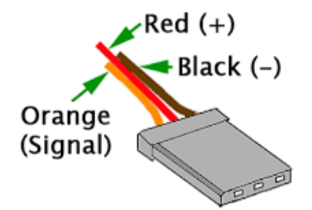
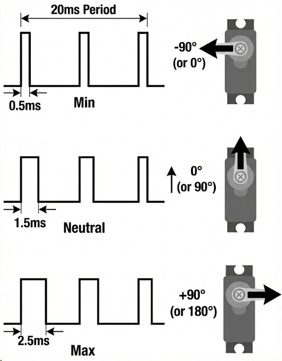

# Lab: Pulse Width Modulation (PWM) ด้วย ESP32

## สารบัญ (Table of Contents)

- [การส่งงาน](#overview)
- [Lab PWM 1: หรี่ไฟ LED](#lab-pwm-1-led)
  - [โจทย์](#lab-pwm-1-challenge)
  - [ตัวอย่างโค้ด PWM บน ESP32](#lab-pwm-1-example-code)
- [Lab PWM 2: ควบคุม Servo Motor ผ่าน Library](#lab-pwm-2-servo-library)
  - [Servo Pinout](#servo-pinout)
  - [ตัวอย่างโค้ด (ESP32Servo)](#lab-pwm-2-example-code)
- [Lab PWM 3: ควบคุม Servo Motor ด้วยการสร้าง PWM เอง](#lab-pwm-3-servo-manual-pwm)
  - [หลักการ](#lab-pwm-3-principles)

---

<a id="overview"></a>
## การส่งงาน

### Lab PWM 1 หรี่ไฟ

- เลือกแสดงรูป pulse ที่ความสว่าง 2 ระดับ (เช่นระดับที่ duty ค่อนข้างสูง และระดับที่ค่อนข้างต่ำ)
- ใช้ Logic Analyzer วัด ความถี่และ duty ของสัญญาณ PWM
- อธิบายหลักการ PWM ที่ได้เรียนรู้ใน Lab นี้

### Lab PWM 3 สร้าง PWM เอง เพื่อคุม Servo Motor 

- Lab PWM 2 ไม่ต้องส่ง
- แสดงรูป pulse ที่ใช้ควบคุม servo โดยเลือกแสดงที่องศามากและน้อยที่สุด
- แสดงภาพ servo ขณะทำงานตาก pulse ข้างต้น
- ใช้ Logic Analyzer วัดความกว้าง pulse
- อธิบายความรู้ PWM ที่ได้รับใน lab นี้

---


<a id="lab-pwm-1-led"></a>
## Lab PWM 1: หรี่ไฟ LED

<a id="lab-pwm-1-challenge"></a>
### โจทย์

- ควบคุมความสว่างของ LED ด้วยปุ่มกด  
- มีอย่างน้อย 5 ระดับ  
- ระดับต่ำสุด = Duty 0%  
- ระดับสูงสุด = Duty 100%

<a id="lab-pwm-1-example-code"></a>
### ตัวอย่างโค้ด PWM บน ESP32

```c
const int ledPin = 16;   // GPIO16
const int freq = 1000;  // Hz
const int resolution = 8;  // 8-bit resolution = 2^8 = 256  levels

void setup() {
  ledcAttach(ledPin, freq, resolution);
}

void loop() {
  // increase the brightness
  for (int duty = 0; duty <= 255; duty++) {
    ledcWrite(ledPin, duty);
    delay(15);
  }

  // decrease the brightness
  for (int duty = 255; duty >= 0; duty--) {
    ledcWrite(ledPin, duty);
    delay(15);
  }
}
```

ESP32 สามารถสร้าง PWM ได้โดยไม่ต้องใช้ Library เพิ่มเติม  
ขั้นตอนหลักคือ

1. เลือก GPIO ที่รองรับ PWM - ไม่ใช่ทุกขาที่รองรับ ดูรูปประกอบ
2. Setup โดยกำหนดความถี่และความละเอียด  
3. ใช้งานโดยกำหนดค่า Duty - สังเกตหน่วย Duty ไม่ใช่ % แต่ขึ้นอยู่กับ resolution เช่น 8 bit จะใช้ duty 0-255 เป็นต้น


> GPIO ที่รองรับ PWM

---

<a id="lab-pwm-2-servo-library"></a>
## Lab PWM 2: ควบคุม Servo Motor - ใช้ Library สำเร็จ

### โจทย์
- ให้สร้าง Useless Machine ที่ทำงานตาม Video ต่อไปนี้
- ใน Lab นี้ให้ใช้ Library สำเร็จรูปในการควบคุม Servo เพื่อให้แน่ใจว่า Hardware ต่อถูก 
- ทำความเข้าใจการทำงานของ Servo Motor เมื่อเทียบกับมอเตอร์ชนิดอื่น เช่น DC, Stepping

## Useless Machine

[](https://www.youtube.com/watch?v=apVR5Htz0K4)
> YouTube Video  
> Click to play

[](https://www.youtube.com/watch?v=jK4Lf9QVRE0)
> YouTube Video  
> Click to play

<a id="servo-pinout"></a>
### Servo Pinout




> การต่อ Servo (ใช้ไฟ 5V)

<a id="lab-pwm-2-example-code"></a>
### ตัวอย่างโค้ด (ESP32Servo)

```c
#include <ESP32Servo.h>   // servo library

Servo myservo;
int servoPin = 18;   // which pin drives the servo
int pos = 0;        // servo heading. Typically 0-180 degrees

void setup() {
  myservo.attach(servoPin);
}

void loop() {
  for (pos = 0; pos <= 180; pos++) {
    myservo.write(pos);
    delay(15);
  }
  for (pos = 180; pos >= 0; pos--) {
    myservo.write(pos);
    delay(15);
  }
}
```

---

<a id="lab-pwm-3-servo-manual-pwm"></a>
## Lab PWM 3: ปรับ Useless Machine โดยการสร้าง PWM เอง เพื่อควบคุม Servo Motor




> PWM ที่ใช้ควบคุม Servo (50 Hz)

<a id="lab-pwm-3-principles"></a>
### หลักการ

- คาบของ PWM = 20 ms (50 Hz)  
- Pulse width = 1–2 ms → 0–180 องศา  
- 1 องศา ≈ 5.67 µs  

หากใช้ PWM Resolution = 8 bit

- 0° → duty ≈ 13  
- 90° → duty ≈ 19  
- 180° → duty ≈ 26  

ความละเอียดสูงขึ้น → คุมมุมได้ละเอียดขึ้น

> องศาที่ได้จริง อาจแตกต่างจากหลักการได้บ้าง ขึ้นอยู่กับรุ่นของ Servo  ขอให้ปรับ PWM ตามความเหมาะสม

---

## สัญญาอนุญาต (License)


ผลงานนี้เผยแพร่ภายใต้สัญญาอนุญาต  
**Creative Commons Attribution–ShareAlike 4.0 International (CC BY-SA 4.0)**  
อนุญาตให้นำไปใช้ แก้ไข และเผยแพร่ต่อได้ โดยต้องระบุที่มา  
และเผยแพร่ภายใต้สัญญาอนุญาตเดียวกัน

โดย  
อ.ดร.อานันท์ สีห์พิทักษ์เกียรติ  
ภาควิชาวิศวกรรมคอมพิวเตอร์ คณะวิศวกรรมศาสตร์  
มหาวิทยาลัยเชียงใหม่


