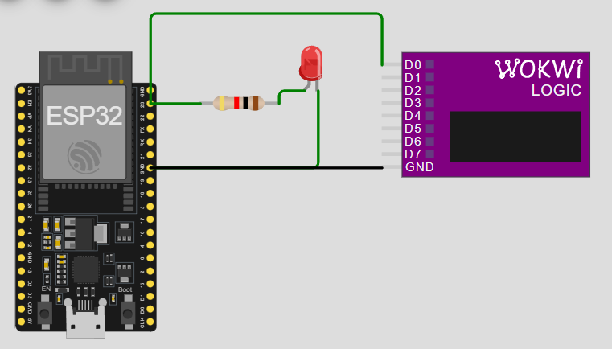
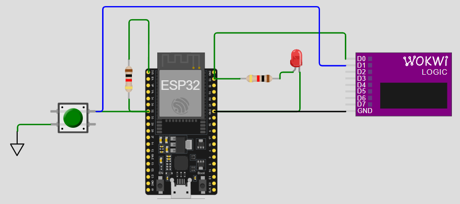
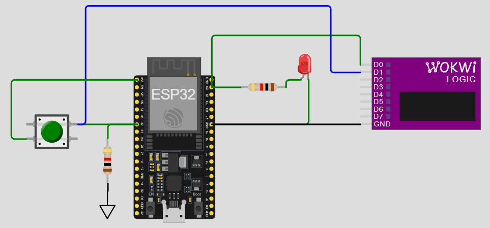

- [เป้าหมายของการทดลองบน Wokwi](#เป้าหมายของการทดลองบน-wokwi)
- [LAB 1.1 - Hello World (Serial Monitor)](#lab-11---hello-world-serial-monitor)
  - [ขั้นตอน](#ขั้นตอน)
  - [สิ่งที่ต้องส่ง](#สิ่งที่ต้องส่ง)
- [LAB 1.2 - ไฟกระพริบ (Blink LED)](#lab-12---ไฟกระพริบ-blink-led)
  - [ขั้นตอน](#ขั้นตอน-1)
  - [สิ่งที่ต้องส่ง](#สิ่งที่ต้องส่ง-1)
- [LAB 1.3 - ปุ่มกดและการอ่านสัญญาณ](#lab-13---ปุ่มกดและการอ่านสัญญาณ)
  - [ขั้นตอน](#ขั้นตอน-2)
  - [สิ่งที่ต้องส่ง](#สิ่งที่ต้องส่ง-2)
- [LAB 1.4 - เปลี่ยนวงจรปุ่มเป็น Pull-down](#lab-14---เปลี่ยนวงจรปุ่มเป็น-pull-down)
  - [ขั้นตอน](#ขั้นตอน-3)
  - [สิ่งที่ต้องส่ง](#สิ่งที่ต้องส่ง-3)
- [LAB 1.5 - นับจำนวนครั้งที่กดปุ่ม](#lab-15---นับจำนวนครั้งที่กดปุ่ม)
  - [เป้าหมาย](#เป้าหมาย)
  - [ขั้นตอน](#ขั้นตอน-4)
  - [สิ่งที่ต้องส่ง](#สิ่งที่ต้องส่ง-4)
- [LAB 1.6 - ดูสัญญาณ Bounce ด้วย Logic Analyzer](#lab-16---ดูสัญญาณ-bounce-ด้วย-logic-analyzer)
  - [ขั้นตอน](#ขั้นตอน-5)
  - [สิ่งที่ต้องส่ง](#สิ่งที่ต้องส่ง-5)
- [รายการส่งทั้งหมด](#รายการส่งทั้งหมด)

# LAB 1 - การทดลองบน Wokwi (ESP32)
ใช้จำลองร่วมกับการทำปฏิบัติการจริง เพื่อช่วยให้เข้าใจหลักการ I/O, Pull-up, การอ่านปุ่ม, และ Bounce ของสัญญาณได้ชัดเจนขึ้น

**บอร์ดที่ใช้:** `ESP32`  
ESP32 มีรุ่นย่อย เช่น ESP32-C3, ESP32-S3 แนะนำให้ใช้รุ่นที่ตรงกับอุปกรณ์จริงที่มี คือ ESP32 

**เว็บไซต์:** https://wokwi.com

---

# เป้าหมายของการทดลองบน Wokwi
- ฝึกใช้เครื่องมือจำลองการทำงาน ESP32  
- ทดลอง LED, ปุ่มกด, Pull-up, Internal Pull-up  
- สังเกตสัญญาณ Bounce โดยใช้ Logic Analyzer  
- ดาวน์โหลด VCD และเปิดใน PulseView

---

# LAB 1.1 - Hello World (Serial Monitor)

## ขั้นตอน
1. เปิด Wokwi → สร้างโปรเจกต์ใหม่ → ESP32  
2. ใช้โค้ดต่อไปนี้:

```cpp
void setup() {
  Serial.begin(9600);
}

void loop() {
  Serial.println("Hello World!");
  delay(1000);
}
```

3. กด "Start"  
4. เปิด Serial Monitor ของ Wokwi  
5. ตรวจสอบว่ามีข้อความแสดงทุก 1 วินาที

## สิ่งที่ต้องส่ง
- ภาพหน้าจอ Serial Monitor แสดงผล “Hello World”

---

# LAB 1.2 - ไฟกระพริบ (Blink LED)


## ขั้นตอน
1. เพิ่ม LED และตัวต้านทานใน Wokwi 
  
- กดปุ่มบวก เพื่อเพิ่มอุปกรณ์
- เพิ่ม LED และ ตัวต้นทาน 
- ลากสายเพื่อต่อวงจรให้สมบูรณ์
- กำหนดสี LED และค่าความต้านทานให้เหมาะสม (ปกติใช้ค่าระหว่าง 500-1000 โอห์ม)

2. ต่อวงจรให้ LED เข้ากับ GPIO23  
3. ใช้โค้ด:

```cpp
#define LED 23
#define DELAY_TIME 1000

void setup() {
  pinMode(LED, OUTPUT);
}

void loop() {
  digitalWrite(LED, HIGH);
  delay(DELAY_TIME);
  digitalWrite(LED, LOW);
  delay(DELAY_TIME);
}
```

4. รันและสังเกตการกระพริบ
5. จับสัญญาณการทำงานด้วย Logic Analyzer



- เพิ่มอุปกรณ์ Logic Analyzer (`Tip: ค้นคำว่า Logic Analyzer ในช่อง Search`)
- เชื่อมขาวัด D0 เข้ากับ GPIO23  และเชื่อมขา GND
- รันโปรแกรมอีกครั้ง เมื่อหยุด Wokwi จะให้ Save ไฟล์ VCD (Voltage Change Dump)
- ดู VDC Plot ในโปรแกรม Pulse View ([ดูคู่มือการติดตั้งและใช้งาน](https://docs.wokwi.com/guides/logic-analyzer#viewing-the-data-in-pulseview))
- วัดความกว้าง pulse ให้เห็นว่า Logic high มีความกว้างถูกต้อง (1000 ms)

## สิ่งที่ต้องส่ง
- ภาพวงจรบน Wokwi  
- ภาพ Pulse View ที่แสดงความกว้าง Pulse

ตัวอย่าง Pulse View


---

# LAB 1.3 - ปุ่มกดและการอ่านสัญญาณ

## 1) กดติด-ปล่อยดับ (Basic Button Control)

### ขั้นตอน
1. เพิ่ม Pushbutton  
2. ต่อปุ่มเข้ากับ GPIO32 + external pull-up  
3. ต่อขา D1 ของ Logic Analyzer เข้ากับขา GPIO32




4. ใช้โค้ด "กดติดปล่อยดับ" ต่อไปนี้:

```cpp
#define LED 23
#define BUTTON 32

void setup() {
  pinMode(LED, OUTPUT);
  pinMode(BUTTON, INPUT);
}

void loop() {
  if (digitalRead(BUTTON) == LOW) {
    digitalWrite(LED, HIGH);
  } else {
    digitalWrite(LED, LOW);
  }
}
```

5. สังเกตุว่าไฟ LED ติดเมื่อกดปุ่ม
6. ศึกษาหลักการวงจร Pull-up 

- ดูผล Pulse - ควรเห็นว่า Logic ของ D0 และ D1 จะตรงกันข้ามเสมอ
- ฝั่งปุ่มกด GPIO32 มีตัวต้านทานต่อขึ้น +3.3V เราเรียกว่า Pull-up เมื่อกดปุ่ม GPIO32 จะถูกดึงลง GND จึงเป็นเหตุผลว่า Pulse ของ GPIO32 กับ GPIO23 จะกลับสถานะกันเสมอ

7. ทดลอง Internal Pull-up:

- ESP32 มี "Internal Pull-up" ให้ใช้ นั่นคือ เป็นตัวต้านทานภายในที่เปิดใช้งานได้  เมื่อเปิดใช้ จะสามารถเอาตัวต้านทาน Pull-up ภายนอกที่ต่อไว้ออกได้  ช่วยลดชิ้นส่วนในวงจร 

- เปิดใช้ Internal pull-up ด้วยคำสั่งนี้ใน setup()

```cpp
pinMode(BUTTON, INPUT_PULLUP);
```

## สิ่งที่ต้องส่ง
- ภาพวงจร  
- ภาพ Pulse View แสดง Logic ของ GPIO

---

# LAB 1.4 - เปลี่ยนวงจรปุ่มเป็น Pull-down



## ขั้นตอน
1. ต่อตัวต้านทานที่ GPIO32 แต่แทนที่จะต่อขึ้นไฟให้ต่อลง GND แทน
2. ปรับวงจรให้ปุ่มเชื่อม GPIO32 เข้ากับไฟเมื่อกด
3. ลองโปรแกรมเดิม (แต่อย่าลืม disable internal pullup ) ควรเห็นว่าพฤิตกรรมจะเป็น กดดับ-ปล่อยติด
4. แก้ไโปรแกรมให้พฤติกรรมกลับมาเป็น กดติด-ปล่อยดับ
5. ดูพฤติกรรม GPIO ของ LED และ ปุ่มกด ใน PulseView

## สิ่งที่ต้องส่ง
- ภาพวงจร
- ภาพ PulseView แสดง Logic ของ GPIO


# LAB 1.5 - นับจำนวนครั้งที่กดปุ่ม

## เป้าหมาย
ป้องกันการนับรัวเมื่อกดค้าง

## ขั้นตอน
1. ใช้วงจรเดิม แต่เปลี่ยนไปใช้ Pull-up
2. ตรวจจับ HIGH→LOW transition  
3. นับครั้งละ 1  
4. พิมพ์ค่าลง Serial Monitor
5. กระพริบ LED เป็นจำนวนครั้งเท่ากับที่นับ  (เช่น กดครั้งแรก→ไฟกระพริบ 1 ครั้ง กดครั้งที่ 5→ไฟกระพริบ 5 ครั้ง)

## สิ่งที่ต้องส่ง
- ภาพ Pulse View แสดง Logic ผลการทำงานที่ถูกต้อง
- 
---

# LAB 1.6 - ดูสัญญาณ Bounce ด้วย Logic Analyzer

- ในวงจรจริง เวลากดปุ่มมักจะเกิด Spark ที่สร้าง Noise ใน GPIO เป็นเวลาสั้น ๆ แต่สามารถทำให้การทำงานของโปรแกรมผิดเพี้ยนได้ เช่น Code นึกว่ามีการกดปุ่มรัวหลายครั้ง
- ใน Simulator จะไม่มี Noise นี้ แต่สามารถจำลองได้โดยการเลือก Option Bounce ในปุ่มกดของ Wokwi

## ขั้นตอน
1. ใช้วงจรเดิม  
2. เปิด bounce: ON  ในตัวเลือกของปุ่มกด  
3. Run → กดปุ่ม → Stop  
4. ดาวน์โหลด VCD  
5. เปิดใน PulseView  
6. Zoom เข้าไปดู Bounce ในช่วงที่ Logic เปลี่ยนจาก High→Low และ Low→High

## สิ่งที่ต้องส่ง
- ภาพ Bounce จาก PulseView  
- อธิบายปัญหา Bounce ในความเข้าใจของท่าน

---

# รายการส่งทั้งหมด
1. LAB 1.1 – ภาพหน้าจอ Serial Monitor แสดง “Hello World”
2. LAB 1.2 – ภาพวงจรบน Wokwi และภาพ PulseView แสดงความกว้าง Pulse (1000 ms)
3. LAB 1.3 – ภาพวงจร และภาพ PulseView แสดง Logic ของ GPIO
4. LAB 1.4 - ภาพวงจร และภาพ PulseView แสดง Logic ของ GPIO
4. LAB 1.5 – ภาพ PulseView แสดง Logic ผลการทำงานที่ถูกต้อง
5. LAB 1.6 – ภาพ Bounce จาก PulseView และคำอธิบายปัญหา Bounce

